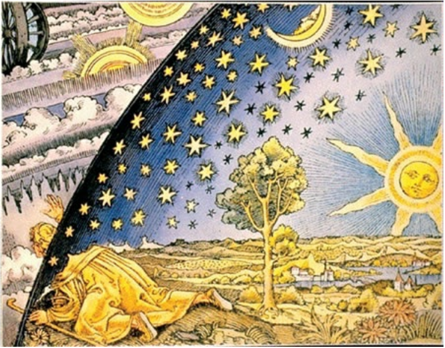
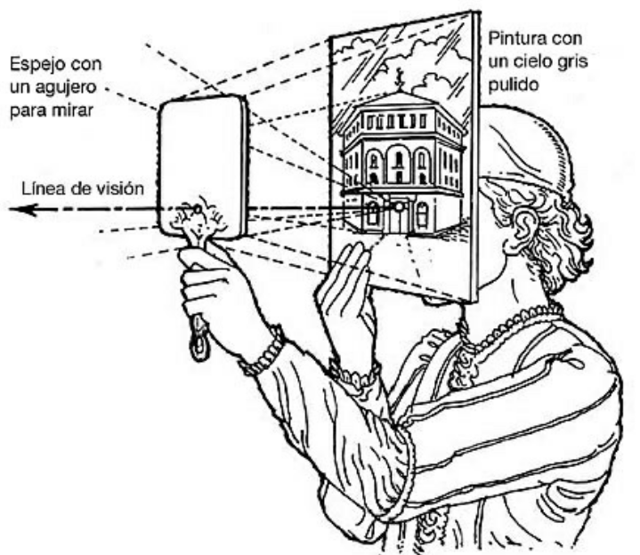
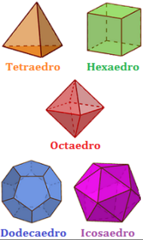

# El mundo como obra de arte

- **Autor:** Frank Wilczek
  - Premio novel en física en 2004. Por el descubrimiento de la libertad asintótica en la teoría de la interacción fuerte. Novel compartido con:
    - David Gross
    - David Politzer
  - Nación en 1951 - 69 años (2021)

  

- **Páginas:** 518
- **Editorial:** Crítica
- **Colección:** Drakontos
- **Inicio de Lectura:** 2021-03-01
- **Fin de Lectura:**

## Personajes

- **Platón:**
  - Propuso una teoría geométrica de los átomos y el universo, basada en las cinco formas simétricas que ahora llamamos sólidos platónicos.
  - valoraba la belleza por encima de la exactitud
  - **Metáfora de la cueva:**
    - la vida diaria nos ofrece una mera sombra de la realidad, pero que, mediante aventuras de la mente, y una expansión sensorial, podemos acceder a su esencia. Y que la esencia es más clara y bella que su sombra.
  - *demiurgo* mediador, que podría interpretarse como *Artesano*, que traducía el ámbito de las Ideas perfectas y eternas a una copia imperfecta, el mundo que experimentamos.
- **Pitágoras:**
  - Teorema de los triángulos rectángulos, una de las más fundamentales relaciones entre los números, por un lado, y los tamaños y las formas, por otro. Unidad entre mente y materia.
  - Mente-Materia-Belleza: Leyes de instrumentos de cuerda.
- **Brunelleschi:**
  - Su geometría proyectiva, que trataba de la apariencia real de las cosas, trajo ideas —la relatividad, la  invariancia, la simetría— no sola bellas en sí mismas, sino preñadas de potencial.
- **Galileo:**
  - *La grandeza y la gloria de Dios brillan maravillosamente en todos Sus trabajos, y puede leerse sobre todo en el libro abierto de los cielos.*
- **Newton:**
  - **Método de análisis y síntesis:**
    - 2 fases para alcanzar entendimiento:
      - Análisis: consideramos las partes más pequeñas de lo que estamos estudiando
      - Síntesis: ascendemos, mediante el razonamiento lógico y  ,matemático
  - *Es mucho mejor hacer un poco con certeza y dejar el resto para otros que vengan después de ti que explicar todas las cosas mediante conjeturas sin asegurarse de nada.*
- **Maxwell:**
  - primer físico en verdad moderno.
  - los ingredientes primarios de la realidad física no son partículas parecidas a puntos, sino campos que llenan el espacio.
  - unificó la electricidad y el magnetismo, sino que derivó la luz como una consecuencia
  - **conjetura inspirada:** belleza y la simetría como guía.
- **Einstein:**
- **Emy Noether:**
- **Dirac:**

## Lectura 2021-03-01

### Lectura 1

- Contraportada:
  - revisión desde Platón y Pitágoras hasta la actualidad.
  - La guía en la búqueda de las leyes del universo son
    - la simetría - armonía, equilbrio-
    - la economía
  - Ecuaciones de átomos y luz, son casi las mismas a las obedecidas por instrumentos musicales.
- He Shiufa: Artista moderno y de caligrafía china

  

  *El doble pez del Taiji es la esencia de la cultura china. Esta imagen fue pintada por He Shuifa junto a un lago a principios del invierno.*
- Partículas virtuales -> partículas reales.
- Carpa:: Nosotros - Esfuerzo:: búsqueda entendimiento.

  

  

  

### Lectura 2

- **Pregunta del libro:** ¿Encarna el mundo ideas bellas?
  - Respuesta **Sí** dada en e siglo XX gracias al desarrolo de la teoría cuántica.
- Las religiones no relacionan la creación del mundo con el arte.
- Fin de antiguos científicos. Encontrar la belleza encarnada en el mundo físico, reflejando la gloria de Dios, era el objetivo de su búsqueda.
- **Número:** producto más puro de la mente.
- **Tamaño:** característica primaria de la Materia
- Teorema de los triángulos rectángulos, una de las más fundamentales relaciones entre los números, por un lado, y los tamaños y las formas, por otro. Unidad entre mente y materia
- Mente-Materia-Belleza: Leyes de instrumentos de cuerda.
- Modelo Estándar -> Teoría Central
  - *Modelo* connota una chapuza provisional desechable, en espera de ser reemplazado por *la cosa de verdad*.
  - *Estándar* connota *convencional*, e insinúa que hay otra sabiduría superior.
- Las ecuaciones de los átomos y la luz son, casi literalmente, las mismas que gobiernan los instrumentos musicales y el sonido.
- Fuerzas de la naturaleza: Encarnan *simetría local*
  - gravedad
  - electromagnetismo
  - las fuerzas nucleares
    - Fuerte
    - Débil
- La Teoría Central
  - Es asimétrica
  - Piezas conectadas con holgura.
  - no explica
    - materia oscura
    - energía oscura.

### Lectura 7

- **Rango:** pg 61- pg 72
- Alfred North: La caracterización general más segura de la tradición filosófica europea es que consiste en una serie de notas a pie de página de la obra de Platón.
- alegoría de la caverna en obra de mayor peso: **La república**
- Glaucón, hermano mayor de Platón
- Platón nos anima a mirar más allá de las apariencias si queremos descubrir la estructura profunda de la realidad.

  

- metafísica: después dela física, usar razonamiento en ves de pruebas, experimentos...
- Parménides -> Bertrand Rusell: Cuando piensas, piensas en algo; cuando usas un nombre, debe ser el nombre de algo. Así, tanto el pensamiento como el lenguaje requieren objetos fuera de sí mismos. Por tanto, no puede haber cambio, pues el cambio consiste en cosas que empiezan a ser o dejan de ser
- Zenón de Elea, estudiante de Parménides, paradoja de aquiles y la tortuga
- Pitágoras: llegamos a un contacto cercano con el mundo de los Ideales eternos y perfectos cuando manejamos conceptos matemáticos como los números o los ssólidos platónicos.
- **Orfismo:** Parte seria de la mitología Griega. Caracteriza las almas humanas como divinas e inmortales, pero condenadas a vivir (durante un período) en un «círculo penoso» de vidas corporales sucesivas a través de la metempsícosis, o transmigración de las almas.

- Si la liberación llega por el compromiso con una realidad oculta, ¿cómo
podemos alcanzarla? Hay dos caminos, hacia dentro y hacia fuera.   Por el camino hacia dentro, examinamos nuestros conceptos de manera crítica, y tratamos de desnudarlos de la escoria de mera apariencia, para alcanzar su significado ideal (es decir, Ideal). Este es el camino de la filosofía y la metafísica.   Por el camino hacia fuera, tomamos las apariencias con sentido crítico e intentamos desnudarlas de las complicaciones para hallar su esencia oculta. Este es el camino de la ciencia y la física. Como hemos anticipado, y como trataremos en profundidad, el camino hacia fuera conduce efectivamente a la liberación.

### Lectura 8

- Llevar un calendario preciso era importante para las sociedades del
mundo antiguo.
- Para Platón, como hemos visto, lo que parecía abrumadoramente importante era el alma humana: su ascenso a la sabiduría, la pureza y un Ideal trascendente. El objetivo primario es identificar los Ideales que inspiraron al Artesano. Las concesiones que Le impusiera la tosquedad de los materiales de construcción son una cuestión secundaria.
- figura geométrica perfecta: Circulo
- Movimiento perfecto: en circulo a velocidad constante.
- Platón: El Ideal y la belleza encima de la precisión
- Aristóteles: Descripción y organización, no se esforzaron por la belleza ni la perfección. se escapan de la geometría y astronomía. No ecuaciones -> descripciones verbales.
- La ciencia artística de la perspectiva trata por entero de ¡capturar la apariencia superficial de las cosas!
- Dominar apariencia - acerca a su escencia. Tratando objetivamente la subjetividad, la dominamos.
- Llamamos a ese punto el punto de fuga de la familia de paralelas, podemos decir que las líneas paralelas se encuentran en el punto de fuga.
- el horizonte como una colección de puntos al infinito.

- Una vez situadas esas diagonales, sabemos que las intersecciones de las líneas naranjas y azules son vértices de las baldosas vecinas. Las líneas amarillas, que pasan por esos vértices y por los puntos de fuga adecuados, contienen por tanto los lados de esas baldosas
- Me he dado cuenta de que valorar estas ideas básicas de la perspectiva abre mis ojos. Más exactamente, esas ideas llevan el mensaje de mis ojos a un contacto más directo con mi mente consciente. Mediante una imaginación disciplinada,  trascendemos la caverna de la sensación ignorante.
- **Geometría proyectiva:** del Renacimiento, modelos (corazón de la física moderna):
  - **Relatividad:** el mismo objeto puede representarse, fielmente y sin pérdidas, de muchas maneras distintas. es la misma esencia de la geometría proyectiva.
  - **Simetría:** estrechamente relacionada con la relatividad, atención al objeto. la rotación del objeto es una simetría de su descripción proyectiva. Podemos cambiar el objeto, rotándolo, sin cambiar su descripción proyectiva. La esencia de la simetría es el Cambio sin Cambio.
  - **Invariancia:** contrapunto de la relatividad. Los rasgos que son comunes a todas las representaciones se definen como invariantes. Definen rasgos del objeto que son válidos desde cualquier perspectiva.
  - **Complementariedad:** intensificación de la relatividad. Principios de la teoría cuántica. descubrimiento genuinamente metafísico: una verdadera rara avis. dice que puede haber muchas visiones distintas del objeto que son igualmente válidas, en principio, pero que, para observar el objeto tienes que elegir una en concreto. La novedad que surge en la teoría cuántica es que resulta imposible que dos retratistas cuánticos retraten, desde diferentes perspectivas, el mismo objeto al mismo tiempo. podemos elegir nuestra división preferida entre lo observado y lo sacrificado de diferentes formas, pero no podemos evitar tener que elegir. Si hay otro pintor trabajando, y jugueteando con nuestro electrón a su manera y con sus propios propósitos, nublará nuestro retrato (y nosotros arruinaremos el suyo). hay muchas visiones del objeto igualmente válidas —perspectivas, en el sentido general de la palabra—, pero son mutuamente excluyentes. El cubismo cuántico es imposible
- Estas grandes  ideas —relatividad, simetría, invariancia, complementariedad—  conforman el corazón de la física moderna. Deberían ser, aunque aún no lo son, centrales para la filosofía y la religión modernas

### Lectura 9 - 81-87

### Lectura 15 - 132 - 141
# Lecturas faltantes:

## Platón I: estructura por simetría; sólidos platónicos

- Los sólidos platónicos son:
  - El tetraedro, con cuatro caras triangulares, cuatro vértices y tres caras que
  se juntan en cada vértice.
  - El octaedro, con ocho caras triangulares, seis vértices y cuatro caras que se juntan en cada vértice.
  - El icosaedro, con veinte caras triangulares, doce vértices y cinco caras que se juntan en cada vértice.
  - El dodecaedro, con doce caras pentagonales, veinte vértices y tres caras que se juntan en cada vértice.
  - El cubo, con seis caras cuadradas, ocho vértices y tres caras que se juntan en cada vértice.

- **Efecto mateo:** Porque al que tiene se le dará más y tendrá en abundancia, pero al que no tiene se le quitará aun lo que tiene.
- **radiolarios:** Los sólidos platónicos se encarnan en sus estructuras
- **Euclides:**
  - Libro: Elementos
    - Establece el método de Análisis y Síntesis en el dominio de las ideas.
- El gran Principia de Newton, el documento fundacional de la moderna física matemática, también sigue el estilo expositivo de Euclides

### Los sólidos platónicos como átomos

- Pitagoras: Timeo (diálogo?)
- átomos - Platón:
  - fuego: tetraedos
  - agua: icosaedros
  - tierra: cubos
  - aire: octaedros
  - Universo en conjunto: dodecaedro
- Aristóteles.
  - quintaesencia - éter: dodecaedro
### Estructura por simetría

- Platón.
  - Demiurgo: creador
  - El mundo no es la realidad última

### Economía de medios

-reglas simples que dan lugar a estructuras de apariencia compleja

### El joven Kepler y la Música de las Esferas

- Planetas conocidos:
  - Mercurio, Venus, la Tierra, Marte, Júpiter y Saturno
- Kepler consideraba que había seis grandes esferas centradas en el Sol. Y se preguntó: ¿por qué seis? ¿Y por qué tienen los tamaños que tienen?
- Los 5 sólidos pueden mediar entre 6 esferas, circunscritos entre sí
- los planetas no describen círculos, sino elipses (primera ley de Kepler), y el Sol no está en el centro de esas elipses (para expertos: está en uno de sus focos)

### Verdades profundas

- Según Bohr, las proposiciones ordinarias se agotan en su significado literal, y habitualmente lo contrario de una verdad es una falsedad. Las proposiciones profundas, sin embargo, tienen un significado que penetra debajo de su superficie. Se puede reconocer una verdad profunda por la propiedad de que su contraria también es una verdad profunda.

### La Última cena de Dalí

- El sacramento de la última cena
- Dodecaedro que enmarca la escena y al espectador.

## Platón II: escapando de la caverna

- Alfred North Whitehead: La caracterización general más segura de la tradición filosófica europea es que consiste en una serie de notas a pie de página de la obra de Platón.

### Alegoría de la caverna

- Aparece en su obra de mayor peso **La república**.
- Sócrates describe la caverna a Glaucón, el hermano mayor de Platón, que también fue estudiante de Sócrates

### Visión de la eternidad; paradoja de la estasis

- metafísica, o después de la física
- En la metafísica, asuntos tales como el ser, el espacio, el tiempo, el conocimiento y la identidad no se abordan con experimentos u observaciones, sino con el razonamiento puro, como las matemáticas
- Bertrand Russell - Parménides:
  - Cuando piensas, piensas en algo; cuando usas un nombre, debe ser el nombre de algo. Así, tanto el pensamiento como el lenguaje requieren objetos fuera de sí mismos. Y puesto que puedes pensar en una cosa o hablar de ella en cierto tiempo y también en otro tiempo, todo aquello en lo que puede pensarse o de lo que puede hablarse debe existir en todos los tiempos. Por tanto, no puede haber cambio, pues el cambio consiste en cosas que empiezan a ser o dejan de ser.
- Zenón:
  - Estudiante de Parménides
  - Paradoja de aquiles y la tortuga
- la respuesta física adecuada a Zenón solo surgió con la mecánica de Newton y las matemáticas que incorpora
### El ideal

- Los Ideales son los objetos perfectos, de los que los objetos reales son copias imperfectas.
- Corrientes de pensamiento:
  - Pitágoras: intuiciones pitagóricas de armonía y perfección. Ideales
  - Parménides: La realidad inmutable
  - Religión orfica: la cara seria de la mitología griega. Caracteriza las almas humanas como divinas e inmortales, pero condenadas a vivir (durante un período) en un «círculo penoso» de vidas corporales sucesivas a través de la metempsícosis, o transmigración de las almas.

### Liberación

- Platón (a través de Sócrates) describe la liberación como un proceso activo, un proceso de aprendizaje y compromiso.
- Caminos a la liberación:
  - Hacia adentro:examinamos nuestros conceptos de manera crítica, y tratamos de desnudarlos de la escoria de mera apariencia. Este es el camino de la filosofía y la metafísica.
  - Hacia afuera: tomamos las apariencias con sentido crítico e intentamos desnudarlas de las complicaciones para hallar su esencia oculta. Este es el camino de la ciencia y la física. **Este conduce a la liberación**

### El regreso a la ingenuidad

- Platón se enfoca en el camino hacia adentro. Real < ideal
- El mundo físico es una representación defectuosa de la realidad última que deberíamos perseguir.

### Dos tipos de astronomía

- Las estaciones y los entes del firmamento fueron muy importantes en las base cultural antigüa.
- Platón: lo más importante es que la teoría sea bella, no que sea enteramente precisa. El objetivo primario es identificar los Ideales que inspiraron al Artesano. Las concesiones que Le impusiera la tosquedad de los materiales de construcción son una cuestión secundaria.
- **Figura perfecta:** circulo
- **Movimiento perfecto:** Circulo a velocidad constante.
- Platón deponía la presición por la belleza.
- Aristóteles: Pusieron el acento en la descripción y la organización, y no se esforzaron por la belleza o la perfección.

## Fragmentos

- En Henan, junto al río Amarillo, hay una cascada llamada Puerta del Dragón. Las carpas de Yulong intentan saltar la catarata, aunque es muy difícil para ellas. Las que lo consiguen se convierten en dragones felices.
- **Galileo:** La filosofía [la Naturaleza] está escrita en el gran libro que tenemos siempre delante de los ojos —me refiero al universo—, pero no podemos entenderlo si no aprendemos primero el lenguaje y captamos los símbolos en que está escrito. El libro está escrito en lenguaje matemático, y los símbolos son triángulos, círculos y otras figuras geométricas, sin cuya ayuda resulta imposible comprender una sola palabra de él; sin las cuales uno merodea en vano por un laberinto oscuro.
- Cada uno de los elementos se construye con una variedad diferente de átomo. Los átomos toman la forma de sólidos platónicos. Los átomos de fuego son tetraedros, los átomos de agua son icosaedros, los átomos de tierra son cubos y los átomos de aire son octaedros. [...] No, el dodecaedro no es un mero átomo: es la forma del universo en su conjunto.

  

- Sobre la representación tridimencional, en un lienzo bidimencional: Aquí la poesía mística emerge como una descripción directa de la
realidad artística.
- **Sobre la alegoría de la caverna:** Y esta historia profundamente subversiva emite desafíos: no aceptes limitaciones. Lucha para ensayar diferentes formas de ver las cosas. Duda de tus percepciones. Sospecha de las autoridades.