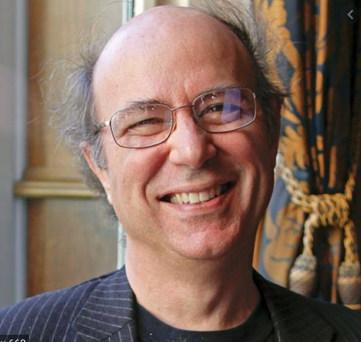
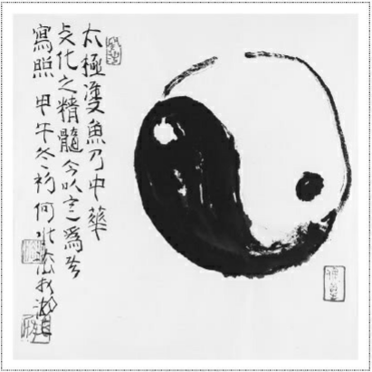
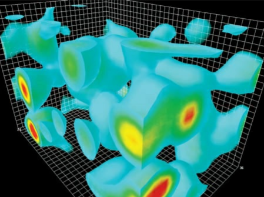
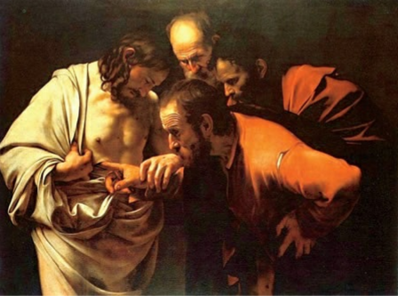
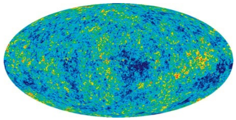

# El mundo como obra de arte

- **Autor:** Frank Wilczek
  - Premio novel en física en 2004. Por el descubrimiento de la libertad asintótica en la teoría de la interacción fuerte. Novel compartido con:
    - David Gross
    - David Politzer
  - Nación en 1951 - 69 años (2021)

  

- **Páginas:** 518
- **Editorial:** Crítica
- **Colección:** Drakontos
- **Inicio de Lectura:** 2021-03-01
- **Fin de Lectura:**

## Personajes

- **Platón:**
  - Propuso una teoría geométrica de los átomos y el universo, basada en las cinco formas simétricas que ahora llamamos sólidos platónicos.
  - valoraba la belleza por encima de la exactitud
  - **Metáfora de la cueva:**
    - la vida diaria nos ofrece una mera sombra de la realidad, pero que, mediante aventuras de la mente, y una expansión sensorial, podemos acceder a su esencia. Y que la esencia es más clara y bella que su sombra.
  - *demiurgo* mediador, que podría interpretarse como *Artesano*, que traducía el ámbito de las Ideas perfectas y eternas a una copia imperfecta, el mundo que experimentamos.
- **Pitágoras:**
  - Teorema de los triángulos rectángulos, una de las más fundamentales relaciones entre los números, por un lado, y los tamaños y las formas, por otro. Unidad entre mente y materia.
  - Mente-Materia-Belleza: Leyes de instrumentos de cuerda.
- **Brunelleschi:**
  - Su geometría proyectiva, que trataba de la apariencia real de las cosas, trajo ideas —la relatividad, la  invariancia, la simetría— no sola bellas en sí mismas, sino preñadas de potencial.
- **Galileo:**
  - *La grandeza y la gloria de Dios brillan maravillosamente en todos Sus trabajos, y puede leerse sobre todo en el libro abierto de los cielos.*
- **Newton:**
  - **Método de análisis y síntesis:**
    - 2 fases para alcanzar entendimiento:
      - Análisis: consideramos las partes más pequeñas de lo que estamos estudiando
      - Síntesis: ascendemos, mediante el razonamiento lógico y  ,matemático
  - *Es mucho mejor hacer un poco con certeza y dejar el resto para otros que vengan después de ti que explicar todas las cosas mediante conjeturas sin asegurarse de nada.*
- **Maxwell:**
  - primer físico en verdad moderno.
  - los ingredientes primarios de la realidad física no son partículas parecidas a puntos, sino campos que llenan el espacio.
  - unificó la electricidad y el magnetismo, sino que derivó la luz como una consecuencia
  - **conjetura inspirada:** belleza y la simetría como guía.
- **Einstein:**
- **Emy Noether:**
- **Dirac:**

## Lectura 2021-03-01

### Lectura 1

- Contraportada:
  - revisión desde Platón y Pitágoras hasta la actualidad.
  - La guía en la búqueda de las leyes del universo son
    - la simetría - armonía, equilbrio-
    - la economía
  - Ecuaciones de átomos y luz, son casi las mismas a las obedecidas por instrumentos musicales.
- He Shiufa: Artista moderno y de caligrafía china

  

  *El doble pez del Taiji es la esencia de la cultura china. Esta imagen fue pintada por He Shuifa junto a un lago a principios del invierno.*
- Partículas virtuales -> partículas reales.
- Carpa:: Nosotros - Esfuerzo:: búsqueda entendimiento.

  

  

  

### Lectura 2

- **Pregunta del libro:** ¿Encarna el mundo ideas bellas?
  - Respuesta **Sí** dada en e siglo XX gracias al desarrolo de la teoría cuántica.
- Las religiones no relacionan la creación del mundo con el arte.
- Fin de antiguos científicos. Encontrar la belleza encarnada en el mundo físico, reflejando la gloria de Dios, era el objetivo de su búsqueda.
- **Número:** producto más puro de la mente.
- **Tamaño:** característica primaria de la Materia
- Teorema de los triángulos rectángulos, una de las más fundamentales relaciones entre los números, por un lado, y los tamaños y las formas, por otro. Unidad entre mente y materia
- Mente-Materia-Belleza: Leyes de instrumentos de cuerda.
- Modelo Estándar -> Teoría Central
  - *Modelo* connota una chapuza provisional desechable, en espera de ser reemplazado por *la cosa de verdad*.
  - *Estándar* connota *convencional*, e insinúa que hay otra sabiduría superior.
- Las ecuaciones de los átomos y la luz son, casi literalmente, las mismas que gobiernan los instrumentos musicales y el sonido.
- Fuerzas de la naturaleza: Encarnan *simetría local*
  - gravedad
  - electromagnetismo
  - las fuerzas nucleares
    - Fuerte
    - Débil
- La Teoría Central
  - Es asimétrica
  - Piezas conectadas con holgura.
  - no explica
    - materia oscura
    - energía oscura.

## Fragmentos

- En Henan, junto al río Amarillo, hay una cascada llamada Puerta del Dragón. Las carpas de Yulong intentan saltar la catarata, aunque es muy difícil para ellas. Las que lo consiguen se convierten en dragones felices.
- **Galileo:** La filosofía [la Naturaleza] está escrita en el gran libro que tenemos siempre delante de los ojos —me refiero al universo—, pero no podemos entenderlo si no aprendemos primero el lenguaje y captamos los símbolos en que está escrito. El libro está escrito en lenguaje matemático, y los símbolos son triángulos, círculos y otras figuras geométricas, sin cuya ayuda resulta imposible comprender una sola palabra de él; sin las cuales uno merodea en vano por un laberinto oscuro.