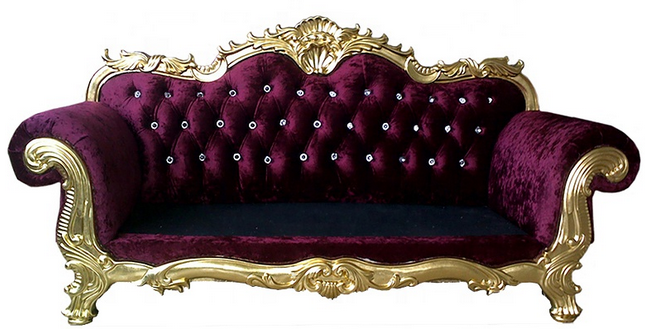

# Anna Karénina

- **Autor:** León Tolstói
- Edición de Josefina Pérez Sancristán
- **Inicio de Lectura:** 09-02-2021
- **Fin de Lectura:**

## Datos importantes de personajes

- Familia Oblonski:
  - Stepán Arkádich Oblonski - Stiva
    - Le fue infiel a su esposa con la institutriz (m-lle Roland) de sus hijos.
    - No se arrepiente de serle infiel a su esposa sino de ser descbierto.
    - Los criados le querían.
    - 7 hijos - 5 viven
    - 34 años
    - Apariencia: Cabello rizado, cutis sonrosado
  - Daria Alexándrovna - Dolly
    - Esposa de Stiva
    - 7 hijos - 5 viven
    - 33 años
  - Matviéi
    - Ayudante de Stiva, casi amigo.
  - Anna Arkadièvna:
    - Hermana de Stiva
  - Matriona Filimónovna
    - Niñera

## Nuevas Palabras

- **Canapé:** Un canapé es un mueble similar a un sofá. Se caracteriza por la presencia de brazos y por ser acolchado en el asiento y en el respaldo. Este mueble surgió durante el reinado de Luis XIV en Francia en el siglo XVII.

- **Tafilete:** Piel curtida bruñida y lustrosa mucho más delgada y adaptable que el cordobán; se utiliza para la fabricación de bolsos, guantes, zapatos, etc.
- **Trajinar:** Moverse mucho una persona o andar de un sitio para otro.
- **Esquela:** Tarjeta o papel en que se notifica la muerte de una persona y el lugar, día y hora del entierro.
- **Irascible:** Que es propenso a irritarse.
- **Azogar:** Cubrir con azogue cristales u otros objetos. EJ: _El mar como un vasto cristal azogado / refleja la lámina de un cielo de cinc_. Contraer la enfermedad producida por la absorción de los vapores del azogue, la cual produce un temblor continuo.
- **Hilvanar:** Hacer algo de manera provisional y esquemática.
- **Fámulo:** Criado o sirviente de un convento u otro medio eclesiástico. Criado o sirviente doméstico.
- **Aya:** Persona que en una casa acomodada se encargaba del cuidado y educación de los niños.
- **Resongar:** Emitir sonidos no articulados o palabras murmuradas entre dientes en señal de enfado o desagrado.
- **:**
- **:**
- **:**
- **:**
- **:**
- **:**
- **:**

