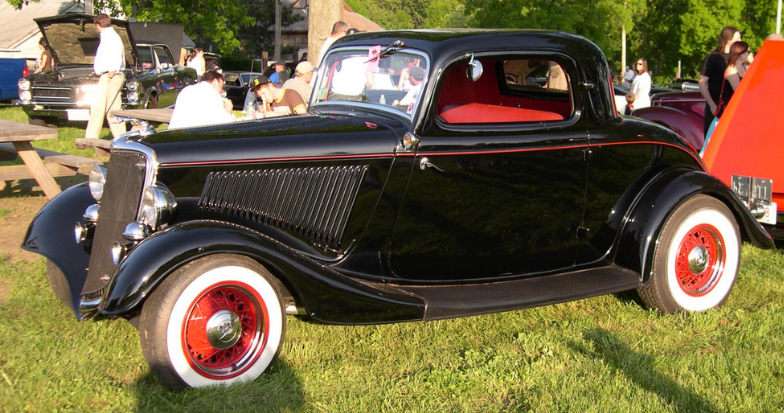
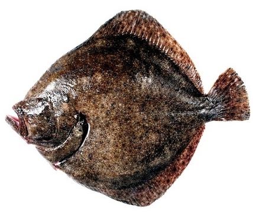
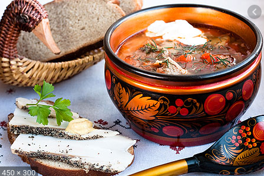
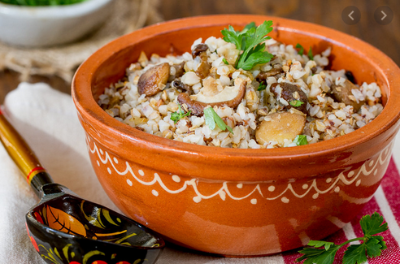
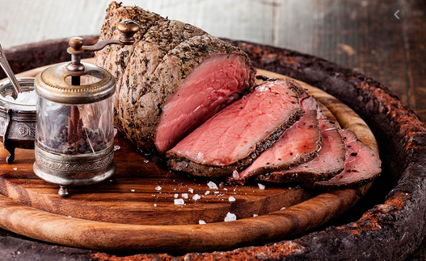
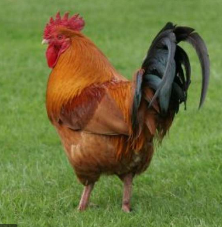

# Anna Karénina

- **Autor:** León Tolstói
- Edición de Josefina Pérez Sancristán
- **Inicio de Lectura:** 09-02-2021
- **Fin de Lectura:**

## Significado de etiquetas

**Posición:**

- **Superior:** Un fragmento grande de la página.
- **Costado:** Una frase corta.

**Color:**

- **Fucsia:** Lievin
- **Amarillo:** Kiti.
- **Naranja:** Vronski

## Datos importantes de personajes y familias

- Familia Oblonski:
  - Stepán Arkádich Oblonski - Stiva
    - Le fue infiel a su esposa con la institutriz (m-lle Roland) de sus hijos.
    - No se arrepiente de serle infiel a su esposa, sino de ser descubierto.
    - Sus tendencias políticas y opiniones eran las de la mayoría, no propias. Tenía tendencias liberales porque se ajustaban a su estilo de vida (muchas deudas, poco dinero).
    - Su comportamiento seguía una tendencia liberal innata, trataba a todos commo sus iguales.
    - Trabajo: Presidentede sala de un tribunal en Monscú.
    - Compañeros de trabajo:
      - Secretario - Zajar Nikítich
      - Filip Iványch Nikitin
      - Mijaíl Stanislávich Griniévich.
    - Los criados le querían.
    - 7 hijos - 5 viven
    - 34 años
    - Apariencia: Cabello rizado negro, cutis sonrosado.
  - Daria Alexándrovna - Dolly - Masha
    - Esposa de Stiva
    - 7 hijos - 5 viven
    - 33 años
  - Matviéi
    - Ayudante de Stiva, casi amigo.
  - Anna Arkadièvna:
    - Hermana de Stiva
    - Esposo: Alexiéi Alexándrovich Karenin
  - Matriona Filimónovna
    - Niñera
  - Grisha
    - Hijo menor
    - Sabe que su padre casi no lo quiere
  - Tania
    - Hija mayor - 8 años
    - Predilecta
  - Vasia
- Familia Karenin:
  - Alexiéi Alexándrovich Karenin
    - Trabajo; Uno de los jefes del ministerio de justicia.
  - Anna Arkadièvna:
    - Seriozha - hijo
      - 8 años
- Konstantín Dimítrich Lievin:
  - La familia es de un antiguo linaje aristocrático en Moscú. Cercana a la familia Scherbatski, la concideraba perfecta y le atribuía los más noble sentimientos y las perfecciones más ideales.
  - Su madre murió cuando él era niño.
  - Amigo de Oblonski desde la adolescencia
  - Tiene 32 años.
  - Familia:
    - Hermanastro de Serguiéi Iványch koznyshov
      - Famoso escritor
    - Hermano de Nikolái Lievin
      - Descarriado
    - Tiene una hermana mayor.
  - Está enamorado de Kiti, la cuñada de Stiva.
  - Tiene tres mil hectareas en el distrito Kazarin.
  - Tiene buen aspecto y estado físico.
  - Es un gran patinador de hielo.
  - El cree que es feo, vulgar y fracasado.
- Familia Scherbatski
  - La familia es de un antiguo linaje aristocrático en Moscú.Cercana a la familia Lievin.
  - La madre rechaza la idea de que los hijos elijan con quién casarse, prefiere a Vronski que a Lievin, a diferencia de su esposo.
  - Los hijos de la familia recibieron una buena educación.
  - El hijo de la familia murió ahogado en el Báltico
  - Kiti:
    - Quiere a Lievin como a un hermano.
    - Tiene 18 años.
    - Condesa Nordston - amiga: Tez amarillenta, brillantes ojos negros, delgada, nerviosa y enfemiza.
  - Dolli - Esposa de Stiva
  - Natalia - Casada con un diplomático llamado Lvov.
  - Nikolái Scherbatski - Primo de Kiti
  - m-lle Linon - Institutriz
- Vronski
  - Guapo, rico, aristócrata, bien relacionado e inteligente.
  - Hijo del conde Kiril Ivánovich
  - Madre: Aliosha - No profesaba amor ni respeto a su madre, pero se comportaba respetuoso y sumiso porque era lo que se esperaba de él.
  - Brillante futuro en el ejército como en la corte.
  - Aprecia a Kiti pero no piensa en casarse con ella. Le gusta la familia Scherbatski porque tiene un aura pura y familiar.
  - Mediana estatura, bien proporcionado, moreno, rostro hermoso de rasgos pasmosamente serenos. Cabello corto negro y mentón rasurado.
- Yegórushka Korsunski - Apuesto caballero, rey de los bailes.
## Frases

- **Lievin:** Bajó, pues, a la pista, procurando no mirarla al rostro, pues su rostro era como el sol. Pero, como pasa con el sol, él no tenía que mirarla para verla.
## Nuevas Palabras

- **Canapé:** Un canapé es un mueble similar a un sofá. Se caracteriza por la presencia de brazos y por ser acolchado en el asiento y en el respaldo. Este mueble surgió durante el reinado de Luis XIV en Francia en el siglo XVII.

  

- **Tafilete:** Piel curtida bruñida y lustrosa mucho más delgada y adaptable que el cordobán; se utiliza para la fabricación de bolsos, guantes, zapatos, etc.
- **Trajinar:** Moverse mucho una persona o andar de un sitio para otro.
- **Esquela:** Tarjeta o papel en que se notifica la muerte de una persona y el lugar, día y hora del entierro.
- **Irascible:** Que es propenso a irritarse.
- **Azogar:** Cubrir con azogue cristales u otros objetos. EJ: _El mar como un vasto cristal azogado / refleja la lámina de un cielo de cinc_. Contraer la enfermedad producida por la absorción de los vapores del azogue, la cual produce un temblor continuo.
- **Hilvanar:** Hacer algo de manera provisional y esquemática.
- **Fámulo:** Criado o sirviente de un convento u otro medio eclesiástico. Criado o sirviente doméstico.
- **Aya:** Persona que en una casa acomodada se encargaba del cuidado y educación de los niños.
- **Resongar:** Emitir sonidos no articulados o palabras murmuradas entre dientes en señal de enfado o desagrado.
- **Sosiego:** Estado de tranquilidad o calma en algo o alguien.
- **Cupé:** Cupé​​ o coupé (del francés couper, «cortar») es un tipo de carrocería de automóvil de dos o tres volúmenes y dos puertas laterales.

  

- **Indulgencia:** Actitud o tendencia de la persona que tiene especial facilidad para perdonar las ofensas, o castigarlas con benevolencia, y para juzgar sin severidad los errores de los demás.
- **Ujier, Hujier:** Portero de un palacio o de un tribunal.
- **Mofarse:** Burlarse de una persona o de una cosa tratándolas con desconsideración o desprecio.
- **Zemstvo:** Asambeas o Cámaras autónomas provinciales y municipales, que se crearon en Rusia en tiempos de Alejandro II.
- **Vehemente:** Que obra de forma irreflexiva y apasionada, dejándose llevar por los sentimientos o los impulsos.
- **Pueril:** 1 - Que es propio de los niños pequeños o tiene alguna característica propia de ellos. 2 - Que tiene poco valor, poco interés o poca importancia.
- **Agachadizas - Gallinago:** Es una especie de ave Charadriiforme de la familia Scolopacidae ampliamente distribuida en Eurasia, África y América.

  

- **Zafio:** Que es inculto y no tiene finura.
- **Condescendiente:** Actitud de la persona que se acomoda o adapta al gusto y la voluntad de otra.
- **Proindiviso:**  El derecho parcial de una persona sobre una propiedad. La razón es que comparte la titularidad con una o más personas, por lo que se considera una comunidad de bienes o copropiedad.
- **Dilapidar:** Malgastar el dinero o los bienes.
- **Apear:** Bajar de un vehículo o de una caballería en que se va montado.
- **Asió:** Tomar o coger con la mano, y, en general, tomar, coger, prender.
- **Inefable:** Que no puede ser dicho, explicado o descrito con palabras, generalmente por tener cualidades excelsas o por ser muy sutil o difuso.
- **Candor:** 1- Máxima blancura. 2 - Ingenuidad, falta total de malicia y de hipocresía.
- **Lánguido:** Que carece de fuerza, vigor o lozanía.
- **Osado:** 1 - Que se atreve a afrontar situaciones difíciles o peligrosas con valentía y entereza. 2 - Que habla u obra con atrevimiento y descaro.
- **Sublevar:** 1 - Enfrentarse a un poder establecido, utilizando la fuerza o las armas. 2 - Irritarse o alterarse mucho una persona.
- **Rodaballo:** El rodaballo o turbot es una especie de pez pleuronectiforme de la familia Scophthalmidae.

  

- **Minuta:** 1 - Cuenta que presenta un profesional liberal como honorarios por su trabajo. Borrador que se hace de un escrito, especialmente de un contrato, antes de redactarlo definitivamente.
- **Schi:** Sopa típica rusa a base de col.

  

- **Kasha:** Plato típico ruso. Especie de gachas de arroz, sémola, alforfón o cebada perlada.

  

- **Rosbif:** El Roast Beef es un corte de buey tierno que se asa al horno. En la cocina inglesa, y por extensión en muchos países de tradición anglosajona como Australia, el roast beef es un plato muy tradicional, servido preferentemente los domingos.

  

- **Campón:** El capón es un gallo castrado a la edad de cuatro meses aproximadamente, antes de comenzar el proceso de engorde. Con ello se consigue mayor tamaño y peso que los gallos camperos normales, y su carne es más fina.

  

- **Labriego:** Persona que tiene por oficio trabajar y cultivar la tierra y vive en el medio rural.
- **Vaticinio:** Acción de anunciar un hecho futuro a partir de ciertos indicios o por simple intuición.
- **Dispensar:** 1 - Otorgar, conceder o distribuir algo, generalmente algo positivo o que implica afecto. 2 - Suministrar algo, especialmente medicamentos o recetas médicas.
- **Aristocracia:** Clase social formada por las personas que poseen títulos nobiliarios concedidos por el rey o heredados de sus antepasados.
- **Tez:** Piel de la cara de una persona.
- **Pasmo:** Asombro o sorpresa exagerada que impide a una persona hablar o reaccionar.
- **Oprobio:** Deshonra o vergüenza públicas.
- **Fatuo:** Que se muestra engreído en su actitud, comportamiento o manera de hablar.
- **Prosapia:** Ascendencia o linaje de una persona, en especial si es ilustre o aristocrático.
- **Fútil:** Que carece de importancia o interés por su falta de fundamento.
- **Incisivo:** 1 - Que está situado en la parte delantera de la boca y tiene la función de cortar los alimentos. 2 - Que profundiza o penetra hasta el fondo de las cosas, o más allá de lo que se considera normal.
- **LLaneza:**
- **Solaz:** Placer, entretenimiento y descanso de las actividades habituales.
- **Yerro:** 1 - Equivocación que se comete por ignorancia o por descuido. 2 - Falta o pecado que atenta contra reglas morales o religiosas.
- **Efigie:** Imagen o representación de una persona, generalmente reproducida en una moneda, una pintura o una escultura.
- **Imberbe:** Que no tiene pelo en la barba o tiene muy poco, en especial si es joven.
- **Marmórea:** Que tiene la dureza, el color u otra característica propia del mármol.
- **Postín:** Distinción o elegancia de las personas ricas.
- **Coloquio:** Conversación entre dos o más personas.
- **:**
- **:**
- **:**
- **:**
- **:**
- **:**
- **:**