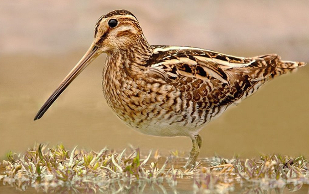

# Anna Karénina

- **Autor:** León Tolstói
- Edición de Josefina Pérez Sancristán
- **Inicio de Lectura:** 09-02-2021
- **Fin de Lectura:**

## Datos importantes de personajes y familias

- Familia Oblonski:
  - Stepán Arkádich Oblonski - Stiva
    - Le fue infiel a su esposa con la institutriz (m-lle Roland) de sus hijos.
    - No se arrepiente de serle infiel a su esposa, sino de ser descubierto.
    - Sus tendencias políticas y opiniones eran las de la mayoría, no propias. Tenía tendencias liberales porque se ajustaban a su estilo de vida (muchas deudas, poco dinero).
    - Su comportamiento seguía una tendencia liberal innata, trataba a todos commo sus iguales.
    - Trabajo: Presidentede sala de un tribunal en Monscú.
    - Compañeros de trabajo:
      - Secretario - Zajar Nikítich
      - Filip Iványch Nikitin
      - Mijaíl Stanislávich Griniévich.
    - Los criados le querían.
    - 7 hijos - 5 viven
    - 34 años
    - Apariencia: Cabello rizado negro, cutis sonrosado.
  - Daria Alexándrovna - Dolly
    - Esposa de Stiva
    - 7 hijos - 5 viven
    - 33 años
  - Matviéi
    - Ayudante de Stiva, casi amigo.
  - Anna Arkadièvna:
    - Hermana de Stiva
    - Esposo: Alexiéi Alexándrovich Karenin
  - Matriona Filimónovna
    - Niñera
  - Grisha
    - Hijo menor
    - Sabe que su padre casi no lo quiere
  - Tania
    - Hija mayor
    - Predilecta
- Familia Karenin:
  - Alexiéi Alexándrovich Karenin
    - Trabajo; Uno de los jefes del ministerio de justicia.
  - Anna Arkadièvna:
- Konstantín Dimítrich Lievin:
  - La familia es de un antiguo linaje aristocrático en Moscú. Cercana a la familia Scherbatski, la concideraba perfecta y le atribuía los más noble sentimientos y las perfecciones más ideales.
  - Su madre murió cuando él era niño.
  - Amigo de Oblonski desde la adolescencia
  - Tiene 32 años.
  - Hermanastro de Serguiéi Iványch koznyshov: Famoso escritor
  - Tiene una hermana mayor.
  - Está enamorado de Kiti, la cuñada de Stiva.
  - Tiene tres mil hectareas en el distrito Kazarin.
  - Tiene buen aspecto y estado físico.
  - El cree que es feo, vulgar y fracasado.
- Familia Scherbatski
  - La familia es de un antiguo linaje aristocrático en Moscú.Cercana a la familia Lievin.
  - Dolli y Kiti recibieron una buena educación.
  - principe - Murió ahogado en el Báltico
  - Kiti
  - Dolli
  - Natalia - Casada con un diplomático llamado Lvov.

## Nuevas Palabras

- **Canapé:** Un canapé es un mueble similar a un sofá. Se caracteriza por la presencia de brazos y por ser acolchado en el asiento y en el respaldo. Este mueble surgió durante el reinado de Luis XIV en Francia en el siglo XVII.

- **Tafilete:** Piel curtida bruñida y lustrosa mucho más delgada y adaptable que el cordobán; se utiliza para la fabricación de bolsos, guantes, zapatos, etc.
- **Trajinar:** Moverse mucho una persona o andar de un sitio para otro.
- **Esquela:** Tarjeta o papel en que se notifica la muerte de una persona y el lugar, día y hora del entierro.
- **Irascible:** Que es propenso a irritarse.
- **Azogar:** Cubrir con azogue cristales u otros objetos. EJ: _El mar como un vasto cristal azogado / refleja la lámina de un cielo de cinc_. Contraer la enfermedad producida por la absorción de los vapores del azogue, la cual produce un temblor continuo.
- **Hilvanar:** Hacer algo de manera provisional y esquemática.
- **Fámulo:** Criado o sirviente de un convento u otro medio eclesiástico. Criado o sirviente doméstico.
- **Aya:** Persona que en una casa acomodada se encargaba del cuidado y educación de los niños.
- **Resongar:** Emitir sonidos no articulados o palabras murmuradas entre dientes en señal de enfado o desagrado.
- **Sosiego:** Estado de tranquilidad o calma en algo o alguien.
- **Cupé:** Cupé​​ o coupé (del francés couper, «cortar») es un tipo de carrocería de automóvil de dos o tres volúmenes y dos puertas laterales.
  
- **Indulgencia:** Actitud o tendencia de la persona que tiene especial facilidad para perdonar las ofensas, o castigarlas con benevolencia, y para juzgar sin severidad los errores de los demás.
- **Ujier, Hujier:** Portero de un palacio o de un tribunal.
- **Mofarse:** Burlarse de una persona o de una cosa tratándolas con desconsideración o desprecio.
- **Zemstvo:** Asambeas o Cámaras autónomas provinciales y municipales, que se crearon en Rusia en tiempos de Alejandro II.
- **Vehemente:** Que obra de forma irreflexiva y apasionada, dejándose llevar por los sentimientos o los impulsos.
- **Pueril:** 1 - Que es propio de los niños pequeños o tiene alguna característica propia de ellos. 2 - Que tiene poco valor, poco interés o poca importancia.
- **Agachadizas - Gallinago:** Es una especie de ave Charadriiforme de la familia Scolopacidae ampliamente distribuida en Eurasia, África y América.
  
- **:**
- **:**
- **:**
- **:**
- **:**
- **:**
- **:**
- **:**
- **:**
- **:**
- **:**
- **:**
- **:**
- **:**
- **:**
- **:**
- **:**
- **:**