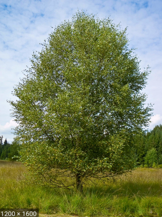
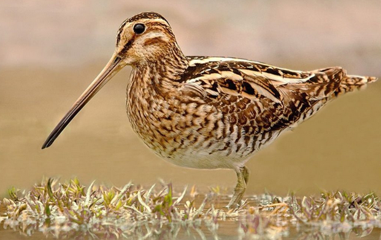
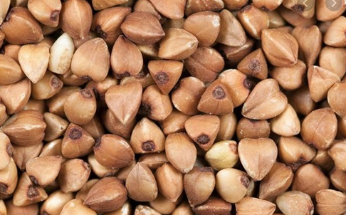
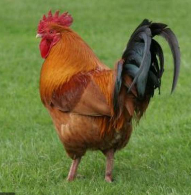
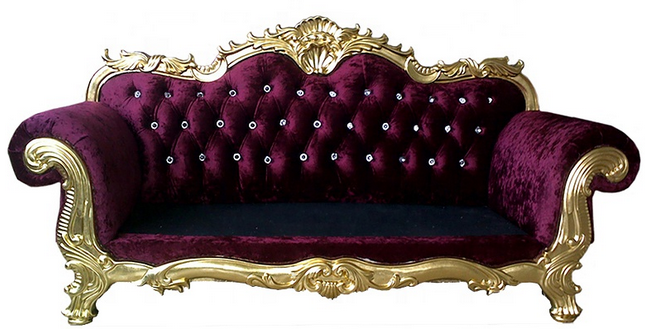
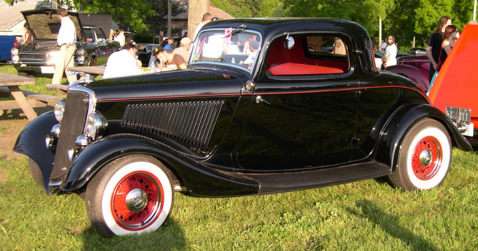
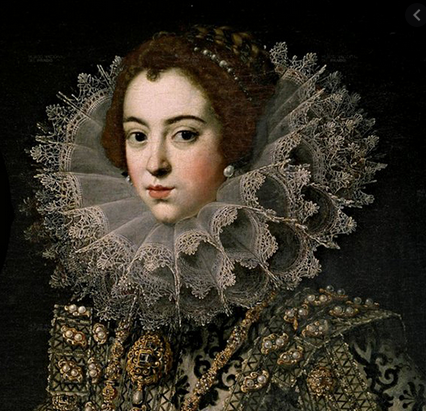
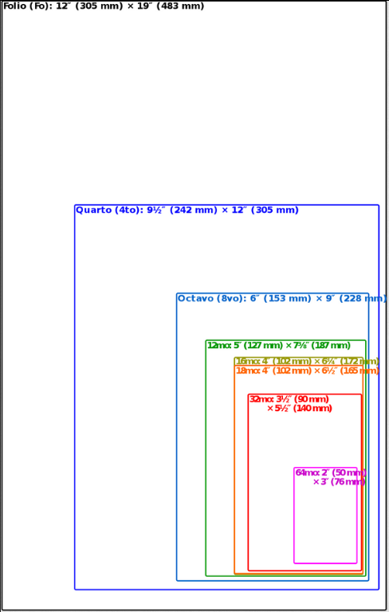
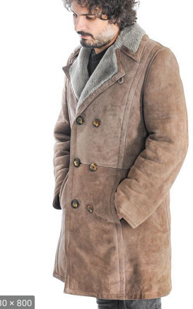
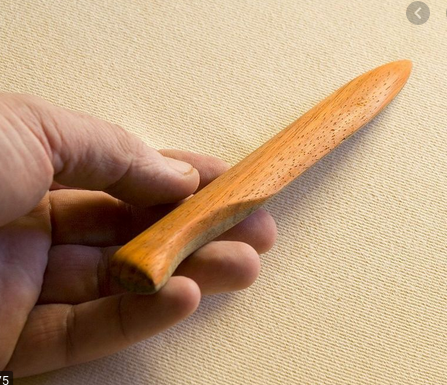

## Nuevas Palabras
## A

- **Abedul:** Árbol de la familia de las betuláceas, de unos diez metros de altura, con hojas pequeñas, puntiagudas y doblemente aserradas o dentadas, que abunda en los montes de Europa.

  

- **Acémila:** Mula o macho que se usa para llevar carga.
- **Adusta:** Que es excesivamente rígido, áspero y desapacible en el trato.
- **Agachadizas - Gallinago:** Es una especie de ave Charadriiforme de la familia Scolopacidae ampliamente distribuida en Eurasia, África y América.

  

- **Alforfón - Trigo Sacarreno:** El alforfón o trigo sarraceno es una planta anual herbácea de la familia Polygonaceae cultivada por sus granos para su consumo humano y animal. Se considera popularmente un cereal, aunque realmente no lo sea, ya que, aunque se parece, no pertenece a la familia de las gramíneas, sino a las poligonáceas.

  

- **Apear:** Bajar de un vehículo o de una caballería en que se va montado.
- **Asió:** Tomar o coger con la mano, y, en general, tomar, coger, prender.
- **Aristocracia:** Clase social formada por las personas que poseen títulos nobiliarios concedidos por el rey o heredados de sus antepasados.
- **Auscultar:** 1 - Intentar averiguar el pensamiento de otra persona o su disposición acerca de un asunto. 2 - Escuchar los sonidos que se producen en el interior de un organismo humano o animal, especialmente en la cavidad torácica y abdominal, mediante los instrumentos adecuados o sin ellos.
- **Aya:** Persona que en una casa acomodada se encargaba del cuidado y educación de los niños.
- **Azogar:** Cubrir con azogue cristales u otros objetos. EJ: _El mar como un vasto cristal azogado / refleja la lámina de un cielo de cinc_. Contraer la enfermedad producida por la absorción de los vapores del azogue, la cual produce un temblor continuo.

## B

- **Barbián:** Que es desenvuelto y simpático.
## C

- **Caftán:** Prenda de vestir de origen oriental, generalmente de seda y con colores vivos, que cubre hasta la mitad de la pierna, tiene mangas cortas y está abierta por la parte delantera superior.
- **Campón:** El capón es un gallo castrado a la edad de cuatro meses aproximadamente, antes de comenzar el proceso de engorde. Con ello se consigue mayor tamaño y peso que los gallos camperos normales, y su carne es más fina.

  

- **Canapé:** Un canapé es un mueble similar a un sofá. Se caracteriza por la presencia de brazos y por ser acolchado en el asiento y en el respaldo. Este mueble surgió durante el reinado de Luis XIV en Francia en el siglo XVII.

  

- **Candor:** 1- Máxima blancura. 2 - Ingenuidad, falta total de malicia y de hipocresía.
- **Coloquio:** Conversación entre dos o más personas.
- **Condescendiente:** Actitud de la persona que se acomoda o adapta al gusto y la voluntad de otra.
- **Conturbar:** Alterar el ánimo de una persona de manera que pierda la serenidad o que no acierte a hablar ni a proseguir lo que hacía.
- **Cupé:** Cupé​​ o coupé (del francés couper, «cortar») es un tipo de carrocería de automóvil de dos o tres volúmenes y dos puertas laterales.

  

- **Cumplimentar:** Hacer una visita de cortesía a alguien con motivo de algún acontecimiento próspero o adverso.

## D

- **Decimónico:** Del siglo XIX o relacionado con él.
- **Dilapidar:** Malgastar el dinero o los bienes.
- **Dispensar:** 1 - Otorgar, conceder o distribuir algo, generalmente algo positivo o que implica afecto. 2 - Suministrar algo, especialmente medicamentos o recetas médicas.
- **Doncella:** Mujer que, a cambio de una retribución económica, realiza los trabajos domésticos de una casa, no relacionados con la cocina, o que sirve a la señora de la casa.

## E

- **Eremita:** Persona que vive sola en un lugar deshabitado, especialmente para dedicar su vida a la oración y al sacrificio.
- **Esquela:** Tarjeta o papel en que se notifica la muerte de una persona y el lugar, día y hora del entierro.

## F

- **Fámulo:** Criado o sirviente de un convento u otro medio eclesiástico. Criado o sirviente doméstico.
- **Fatuo:** Que se muestra engreído en su actitud, comportamiento o manera de hablar.
- **Fullería:** Trampa en el juego o astucia con que se pretende engañar.
- **Fútil:** Que carece de importancia o interés por su falta de fundamento.

## G

- **Gorguera:** Cuello rígido, redondo, generalmente de lino, holanda o encaje, doblado formando pliegues y ondulaciones, que se usó en Europa occidental los siglos XVI y XVII.

  

- **Gozne:** Bisagra, especialmente la de una puerta o ventana.

## H

- **Hilvanar:** Hacer algo de manera provisional y esquemática.

## I

- **Ignominia:** Ofensa grave que sufre el honor o la dignidad de una persona.
- **Imberbe:** Que no tiene pelo en la barba o tiene muy poco, en especial si es joven.
- **Incisivo:** 1 - Que está situado en la parte delantera de la boca y tiene la función de cortar los alimentos. 2 - Que profundiza o penetra hasta el fondo de las cosas, o más allá de lo que se considera normal.
- **Indulgencia:** Actitud o tendencia de la persona que tiene especial facilidad para perdonar las ofensas, o castigarlas con benevolencia, y para juzgar sin severidad los errores de los demás.
- **Inefable:** Que no puede ser dicho, explicado o descrito con palabras, generalmente por tener cualidades excelsas o por ser muy sutil o difuso.
- **In-folio:** In-folio o infolio (del latín in folio, en hoja) o, abreviado como in-2º, es un término técnico utilizado en encuadernación que indica el tamaño de un libro, donde la hoja impresa se ha doblado sólo una vez sobre el lado menor, por lo que da lugar a dos folios que equivalen a cuatro páginas.  
Cuando la hoja se dobla en cuatro, se habla de in-cuarto o in-4º; si en 8, in-octavo o in-8º; si en 16, in-decimosexto o in-16º; si en 32, in-32º y si en 64, in-64º.

  

- **Intemperancia:** Falta de templanza o moderación.
- **Irascible:** Que es propenso a irritarse.

## J

## K

- **Kasha:** Plato típico ruso. Especie de gachas de arroz, sémola, alforfón o cebada perlada.

  

## L

- **Labriego:** Persona que tiene por oficio trabajar y cultivar la tierra y vive en el medio rural.
- **Lánguido:** Que carece de fuerza, vigor o lozanía.
- **Lisonjar:** Alabar de forma exagerada y generalmente interesada a una persona para conseguir un favor o para ganar su voluntad.
- **LLaneza:** Manera sencilla, clara de hacer o decir las cosas.

## M

- **Marmórea:** Que tiene la dureza, el color u otra característica propia del mármol.
- **Mendrugo:** Pedazo de pan duro o desechado, especialmente el sobrante.
- **Menester:** 1  Falta o necesidad de algo. 2 - Ser preciso o necesario.
- **Minuta:** 1 - Cuenta que presenta un profesional liberal como honorarios por su trabajo. Borrador que se hace de un escrito, especialmente de un contrato, antes de redactarlo definitivamente.
- **Mofarse:** Burlarse de una persona o de una cosa tratándolas con desconsideración o desprecio.

## N

## Ñ

## O

- **Oblongo:** Que es más largo que ancho o que es más largo de lo que es habitual entre las cosas de su mismo género.
- **Oprobio:** Deshonra o vergüenza públicas.
- **Osado:** 1 - Que se atreve a afrontar situaciones difíciles o peligrosas con valentía y entereza. 2 - Que habla u obra con atrevimiento y descaro.

## P

- **Paneslavismo:** El paneslavismo es un movimiento político y cultural, nacido de una ideología nacionalista, surgido en el siglo XIX con el objetivo de promover la unión cultural, religiosa y política, así como la mutua cooperación, entre todos los países eslavos de Europa.
- **Pasmo:** Asombro o sorpresa exagerada que impide a una persona hablar o reaccionar.
- **Pelliza:** Chaqueta con cuello y bocamangas de piel o reforzados de otra tela.

  

- **Plegadera:** Utensilio para plegar o cortar papel que tiene forma parecida a un cuchillo sin filo.

  

- **Porra:** Palo con una bola o cabeza gruesa y redondeada en uno de sus extremos, que se usa como arma para golpear.
- **Postín:** Distinción o elegancia de las personas ricas.
- **Proindiviso:**  El derecho parcial de una persona sobre una propiedad. La razón es que comparte la titularidad con una o más personas, por lo que se considera una comunidad de bienes o copropiedad.
- **Prosapia:** Ascendencia o linaje de una persona, en especial si es ilustre o aristocrático.
- **Pueril:** 1 - Que es propio de los niños pequeños o tiene alguna característica propia de ellos. 2 - Que tiene poco valor, poco interés o poca importancia.

## Q

## R

- **Ralo:** Que es poco espeso o poblado.
- **Resongar:** Emitir sonidos no articulados o palabras murmuradas entre dientes en señal de enfado o desagrado.
- **Rodaballo:** El rodaballo o turbot es una especie de pez pleuronectiforme de la familia Scophthalmidae.

  

- **Rosbif:** El Roast Beef es un corte de buey tierno que se asa al horno. En la cocina inglesa, y por extensión en muchos países de tradición anglosajona como Australia, el roast beef es un plato muy tradicional, servido preferentemente los domingos.

  

## S

- **Schi:** Sopa típica rusa a base de col.

  

- **Solaz:** Placer, entretenimiento y descanso de las actividades habituales.
- **Sosiego:** Estado de tranquilidad o calma en algo o alguien.
- **Sublevar:** 1 - Enfrentarse a un poder establecido, utilizando la fuerza o las armas. 2 - Irritarse o alterarse mucho una persona.

## T

- **Tafilete:** Piel curtida bruñida y lustrosa mucho más delgada y adaptable que el cordobán; se utiliza para la fabricación de bolsos, guantes, zapatos, etc.
- **Tapia:** Trozo de pared o muro que se hace de una sola vez con barro apisonado en un molde (tapial) y después secado al sol.
- **Tez:** Piel de la cara de una persona.
- **Trajinar:** Moverse mucho una persona o andar de un sitio para otro.
- **Trascender:** Hacer sentir sus efectos o tener consecuencias en lugar o medio distinto de aquel en que se produce.

## U

- **Ujier, Hujier:** Portero de un palacio o de un tribunal.

## V

- **Vaticinio:** Acción de anunciar un hecho futuro a partir de ciertos indicios o por simple intuición.
- **Vehemente:** Que obra de forma irreflexiva y apasionada, dejándose llevar por los sentimientos o los impulsos.

## W

## X

## Y

## Z

- **Zafio:** Que es inculto y no tiene finura.
- **Zemstvo:** Asambeas o Cámaras autónomas provinciales y municipales, que se crearon en Rusia en tiempos de Alejandro II.
- **Zíngaro:** Que pertenece a la raza gitana, especialmente la de Europa central.