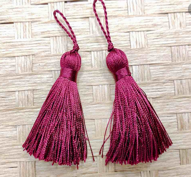
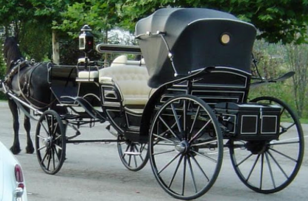
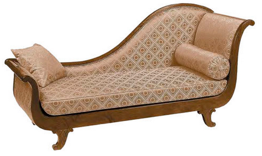
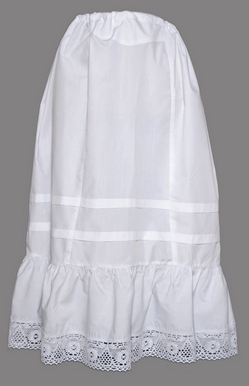
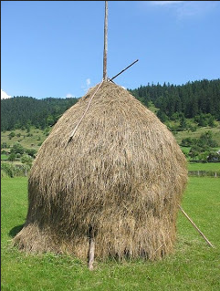
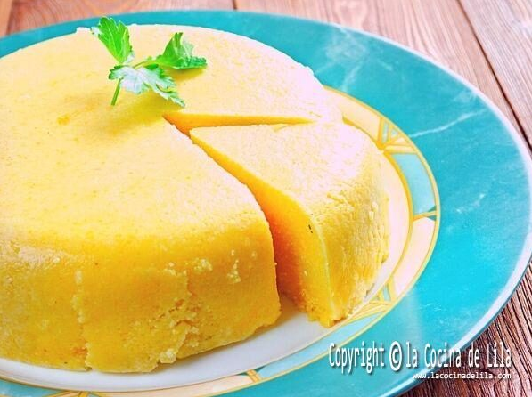
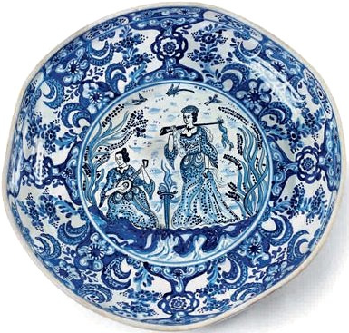
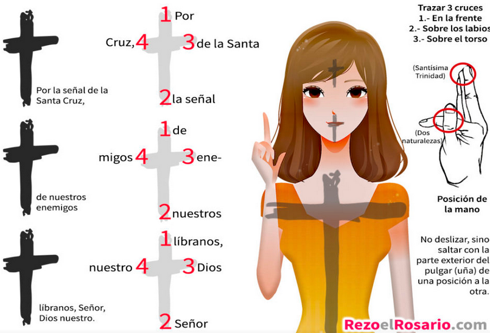
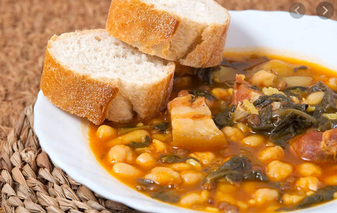
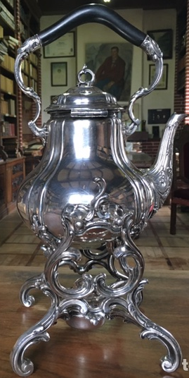

## Nuevas Palabras
## A

- **Abedul:** Árbol de la familia de las betuláceas, de unos diez metros de altura, con hojas pequeñas, puntiagudas y doblemente aserradas o dentadas, que abunda en los montes de Europa.

  

- **Acémila:** Mula o macho que se usa para llevar carga.
- **Adusta:** Que es excesivamente rígido, áspero y desapacible en el trato.
- **Agachadizas - Gallinago:** Es una especie de ave Charadriiforme de la familia Scolopacidae ampliamente distribuida en Eurasia, África y América.

  

- **Aludir:** Referirse a una persona o una cosa sin nombrarlos de forma expresa.
- **Alforfón - Trigo Sacarreno:** El alforfón o trigo sarraceno es una planta anual herbácea de la familia Polygonaceae cultivada por sus granos para su consumo humano y animal. Se considera popularmente un cereal, aunque realmente no lo sea, ya que, aunque se parece, no pertenece a la familia de las gramíneas, sino a las poligonáceas.

  

- **Aliciente:** Aspecto positivo de algo, que sirve de estímulo y mueve a una persona a realizar una acción o a actuar de determinada manera.
- **Añorar:** Recordar con pena a alguien o algo ausente, lejano, perdido o del que se ha sido privado.
- **Aquilina - (o):** Que es aguileño
- **Apear:** Bajar de un vehículo o de una caballería en que se va montado.
- **Arrobamiento:** Estado de la persona que siente un placer, una admiración o una alegría tan intensos que no puede pensar ni sentir nada más.
- **Asió:** Tomar o coger con la mano, y, en general, tomar, coger, prender.
- **Aristocracia:** Clase social formada por las personas que poseen títulos nobiliarios concedidos por el rey o heredados de sus antepasados.
- **Asiduo-(a):** Que realiza con constancia y con cierta continuidad o frecuencia alguna cosa.
- **Auscultar:** 1 - Intentar averiguar el pensamiento de otra persona o su disposición acerca de un asunto. 2 - Escuchar los sonidos que se producen en el interior de un organismo humano o animal, especialmente en la cavidad torácica y abdominal, mediante los instrumentos adecuados o sin ellos.
- **Aya:** Persona que en una casa acomodada se encargaba del cuidado y educación de los niños.
- **Azogar:** Cubrir con azogue cristales u otros objetos. EJ: _El mar como un vasto cristal azogado / refleja la lámina de un cielo de cinc_. Contraer la enfermedad producida por la absorción de los vapores del azogue, la cual produce un temblor continuo.

## B

- **Barbián:** Que es desenvuelto y simpático.
- **Bambolear:** Hacer mover una persona o una cosa de un lado a otro de modo alternativo y continuado manteniendo fijo algún punto, en vaivén.
- **Bribón-(ona):** Que es astuto y taimado, especialmente si utiliza artimañas para engañar o cometer delitos menores.
- **Bruma:** La bruma es un fenómeno atmosférico, consistente en la suspensión de partículas diminutas de agua u otra materia higroscópica que limitan la visibilidad. Se llama así particularmente a la niebla que se forma sobre el mar.

  

- **Bocio:** Crecimiento anormal de la glándula con forma de mariposa ubicada debajo de la nuez de Adán (tiroides).
El bocio generalmente aparece como resultado de una deficiencia de yodo o una inflamación de la glándula tiroides.

  

- **Borla:** Es la terminación de un grupo de hilos trenzados o fruncidos. En uno de sus extremos, sobresale un cordón holgado, del que cuelga, y en el otro costado tiene flecos. Habitualmente, las borlas son elementos decorativos, y suelen encontrarse en el dobladillo de algunas prendas de vestir y de cortinas.

  

## C

- **Caftán:** Prenda de vestir de origen oriental, generalmente de seda y con colores vivos, que cubre hasta la mitad de la pierna, tiene mangas cortas y está abierta por la parte delantera superior.
- **Calesa:** Coche de paseo tirado por caballos, de dos o cuatro ruedas, con la caja o armazón abierta por delante y con cubierta o techo plegable.

  

- **Campón:** El capón es un gallo castrado a la edad de cuatro meses aproximadamente, antes de comenzar el proceso de engorde. Con ello se consigue mayor tamaño y peso que los gallos camperos normales, y su carne es más fina.

  

- **Canapé:** Un canapé es un mueble similar a un sofá. Se caracteriza por la presencia de brazos y por ser acolchado en el asiento y en el respaldo. Este mueble surgió durante el reinado de Luis XIV en Francia en el siglo XVII.

  

- **Candor:** 1- Máxima blancura. 2 - Ingenuidad, falta total de malicia y de hipocresía.
- **Coloquio:** Conversación entre dos o más personas.
- **Condescendiente:** Actitud de la persona que se acomoda o adapta al gusto y la voluntad de otra.
- **Conturbar:** Alterar el ánimo de una persona de manera que pierda la serenidad o que no acierte a hablar ni a proseguir lo que hacía.
- **Cupé:** Cupé​​ o coupé (del francés couper, «cortar») es un tipo de carrocería de automóvil de dos o tres volúmenes y dos puertas laterales.

  

- **Cumplimentar:** Hacer una visita de cortesía a alguien con motivo de algún acontecimiento próspero o adverso.

## D

- **Decimónico:** Del siglo XIX o relacionado con él.
- **Dilapidar:** Malgastar el dinero o los bienes.
- **Dispensar:** 1 - Otorgar, conceder o distribuir algo, generalmente algo positivo o que implica afecto. 2 - Suministrar algo, especialmente medicamentos o recetas médicas.
- **Diván:** Un diván es un tipo de mueble para sentarse, similar al sofá. Originalmente, en Oriente, un diván era un asiento largo formado por un colchón puesto contra un lado de la estancia, bien en el suelo, bien sobre una estructura o un marco levantado, con cojines para apoyarse.

  

- **Doncella:** Mujer que, a cambio de una retribución económica, realiza los trabajos domésticos de una casa, no relacionados con la cocina, o que sirve a la señora de la casa.
- **Duela:** Tablilla con que se forman las paredes curvas de un tonel, barril o cuba.

## E

- **Enagua:** Una enagua ​ es una prenda de ropa interior femenina. Se usa más en plural.​ También se conocen como combinación.​ La enagua es una falda usada como ropa interior pero sobre ropa interior íntima.

  

- **Encabritar:** 1 - Provocar agitación o excitación en algo o a alguien. 2 - Ponerse [un caballo] sobre las patas traseras, levantando las delanteras.
- **Eremita:** Persona que vive sola en un lugar deshabitado, especialmente para dedicar su vida a la oración y al sacrificio.
- **Esquela:** Tarjeta o papel en que se notifica la muerte de una persona y el lugar, día y hora del entierro.
- **Exámine:** 1 - Que está sin vida o no da señales de vida. 2 - Que está muy debilitado o agotado.

## F

- **Fámulo:** Criado o sirviente de un convento u otro medio eclesiástico. Criado o sirviente doméstico.
- **Fatuo:** Que se muestra engreído en su actitud, comportamiento o manera de hablar.
- **Fullería:** Trampa en el juego o astucia con que se pretende engañar.
- **Fustigar:** 1 - Dar golpes o azotar con un instrumento, especialmente al caballo con la fusta para estimularlo. 2 - Criticar o reprender con dureza a una persona o una cosa.
- **Fútil:** Que carece de importancia o interés por su falta de fundamento.

## G

- **Gorguera:** Cuello rígido, redondo, generalmente de lino, holanda o encaje, doblado formando pliegues y ondulaciones, que se usó en Europa occidental los siglos XVI y XVII.

  

- **Gozne:** Bisagra, especialmente la de una puerta o ventana.
- **Guisa:** Modo, manera.

## H

- **Hacina:** Conjunto de haces de mies colocados unos sobre otros formando un montón.

  

- **Hastío:** Aburrimiento muy grande.
- **Hilvanar:** Hacer algo de manera provisional y esquemática.
- **Hirsuto:** Que es áspero, duro y tieso.

## I

- **Ignominia:** Ofensa grave que sufre el honor o la dignidad de una persona.
- **Imberbe:** Que no tiene pelo en la barba o tiene muy poco, en especial si es joven.
- **Impávido:** 1 - Que hace frente a una situación de peligro o riesgo sin dejarse dominar por el miedo o la angustia. 2 - Que no se altera, perturba o muestra emoción alguna ante una impresión o estímulo externo que normalmente producen turbación, desencadenan una emoción o inducen a determinada acción.
- **Incisivo:** 1 - Que está situado en la parte delantera de la boca y tiene la función de cortar los alimentos. 2 - Que profundiza o penetra hasta el fondo de las cosas, o más allá de lo que se considera normal.
- **Indulgencia:** Actitud o tendencia de la persona que tiene especial facilidad para perdonar las ofensas, o castigarlas con benevolencia, y para juzgar sin severidad los errores de los demás.
- **Inefable:** Que no puede ser dicho, explicado o descrito con palabras, generalmente por tener cualidades excelsas o por ser muy sutil o difuso.
- **Infimo:** Que es muy bajo en cantidad, calidad o importancia.
- **In-folio:** In-folio o infolio (del latín in folio, en hoja) o, abreviado como in-2º, es un término técnico utilizado en encuadernación que indica el tamaño de un libro, donde la hoja impresa se ha doblado sólo una vez sobre el lado menor, por lo que da lugar a dos folios que equivalen a cuatro páginas.  
Cuando la hoja se dobla en cuatro, se habla de in-cuarto o in-4º; si en 8, in-octavo o in-8º; si en 16, in-decimosexto o in-16º; si en 32, in-32º y si en 64, in-64º.

  

- **Inocular:** Introducir en el organismo por medios artificiales el virus o la bacteria de una enfermedad contagiosa.
- **Intemperancia:** Falta de templanza o moderación.
- **Irascible:** Que es propenso a irritarse.

## J

- **Jovial:** Que es alegre de modo que resulta festivo y apacible.
- **Juerga:** Diversión o fiesta animada, bulliciosa y en la que a veces se cometen excesos.
## K

- **Kasha:** Plato típico ruso. Especie de gachas de arroz, sémola, alforfón o cebada perlada.

  

## L

- **Labriego:** Persona que tiene por oficio trabajar y cultivar la tierra y vive en el medio rural.
- **Lacayo::** 1 - Criado uniformado que acompañaba a su señor para prestarle ciertos servicios, como abrirle y cerrarle la puerta del automóvil cuando este viajaba. 2 - Soldado de a pie que, junto con otro, acompañaba a un caballero en la guerra e iba armado con una ballesta.
- **Lánguido:** Que carece de fuerza, vigor o lozanía.
- **Lisonjar:** Alabar de forma exagerada y generalmente interesada a una persona para conseguir un favor o para ganar su voluntad.
- **LLaneza:** Manera sencilla, clara de hacer o decir las cosas.
- **Lóbrego:** 1 - Que es oscuro o sombrío e inspira temor o tristeza. 2 - Que es confuso o incierto.

## M

- **Malediciencia:** Acción de maldecir o difamar a alguien.
- **Mamaliga:** La mămăligă, pulicka en húngaro es un pan elaborado con harina de maíz, sémola consistente en una masa de color amarillo. Es muy típica en la cocina rumana, y se asemeja a la polenta italiana. La mămăliga es un alimento tradicional de Rumanía y Moldavia.

  

- **Marmórea:** Que tiene la dureza, el color u otra característica propia del mármol.
- **Mayólica:** Es el nombre que se da desde el Renacimiento a un tipo de decoración cerámica sobre loza estannífera, con un esmalte de plomo opacificado con estaño, posteriormente se decora los diversos motivos con óxidos sobre la anterior base.

  

- **Mendrugo:** Pedazo de pan duro o desechado, especialmente el sobrante.
- **Menester:** 1  Falta o necesidad de algo. 2 - Ser preciso o necesario.
- **Mies:** Cereal que ya está maduro para ser recolectado.
- **Mieses:** Terrenos en los que se cultivan cereales.
- **Minuta:** 1 - Cuenta que presenta un profesional liberal como honorarios por su trabajo. Borrador que se hace de un escrito, especialmente de un contrato, antes de redactarlo definitivamente.
- **Mofarse:** Burlarse de una persona o de una cosa tratándolas con desconsideración o desprecio.

## N

## Ñ

## O

- **Oblongo:** Que es más largo que ancho o que es más largo de lo que es habitual entre las cosas de su mismo género.
- **Oprobio:** Deshonra o vergüenza públicas.
- **Ortodoxia:** Conformidad con los principios de una doctrina o con las normas o prácticas tradicionales, aceptadas por la mayoría como las más adecuadas en un determinado ámbito.
- **Osado:** 1 - Que se atreve a afrontar situaciones difíciles o peligrosas con valentía y entereza. 2 - Que habla u obra con atrevimiento y descaro.

## P

- **Palimpsesto:** Manuscrito en el que se ha borrado, mediante raspado u otro procedimiento, el texto primitivo para volver a escribir un nuevo texto.
- **Paneslavismo:** El paneslavismo es un movimiento político y cultural, nacido de una ideología nacionalista, surgido en el siglo XIX con el objetivo de promover la unión cultural, religiosa y política, así como la mutua cooperación, entre todos los países eslavos de Europa.
- **Párvulo:** Niño de corta edad, que no ha alcanzado la edad escolar, especialmente el que asiste a un centro o a una clase de educación preescolar.
- **Parlamentar:** Discutir sobre un asunto o sobre un problema con la intención de llegar a un acuerdo o de encontrar una solución.
- **Pasmo:** Asombro o sorpresa exagerada que impide a una persona hablar o reaccionar.
- **Pecuniario:** Del dinero o relacionado con el dinero.
- **Pelliza:** Chaqueta con cuello y bocamangas de piel o reforzados de otra tela.

  

- **Peñasco:** Roca de mayor tamaño y altura que la peña, situada generalmente en un lugar alto.
- **Persignar:** Hacer con la punta de los dedos de la mano, especialmente con los dedos índice y pulgar, tres cruces, la primera en la frente, la segunda en la boca y la tercera en el pecho.

- **Piafar:** Alzar el caballo, estando parado, las patas delanteras alternativamente dejándolas caer con fuerza y en el mismo punto en que estaban.
- **Plegadera:** Utensilio para plegar o cortar papel que tiene forma parecida a un cuchillo sin filo.

  

- **Porra:** Palo con una bola o cabeza gruesa y redondeada en uno de sus extremos, que se usa como arma para golpear.
- **Postín:** Distinción o elegancia de las personas ricas.
- **Postrernarse:** Arrodillarse en señal de respeto.
- **Potaje:** Guiso caldoso que se prepara con legumbres y verduras o arroz al que en ocasiones se le añade trozos de algún tipo de carne o de embutido; es un plato típico de diversas regiones españolas, variando en cada una el tipo y cantidad de ingredientes.

  

- **Presteza:** Habilidad y rapidez para hacer o decir una cosa.
- **Proindiviso:**  El derecho parcial de una persona sobre una propiedad. La razón es que comparte la titularidad con una o más personas, por lo que se considera una comunidad de bienes o copropiedad.
- **Prosapia:** Ascendencia o linaje de una persona, en especial si es ilustre o aristocrático.
- **Pueril:** 1 - Que es propio de los niños pequeños o tiene alguna característica propia de ellos. 2 - Que tiene poco valor, poco interés o poca importancia.

## Q

## R

- **Ralo:** Que es poco espeso o poblado.
- **Resongar:** Emitir sonidos no articulados o palabras murmuradas entre dientes en señal de enfado o desagrado.
- **Reticencia:** Hecho de insinuar o no decir directamente algo, generalmente con intención maliciosa.
- **Rezumar:** Salir [un líquido] de un cuerpo o del recipiente en que está contenido, por transpiración o a través de sus rendijas.
- **Rodaballo:** El rodaballo o turbot es una especie de pez pleuronectiforme de la familia Scophthalmidae.

  

- **Rosbif:** El Roast Beef es un corte de buey tierno que se asa al horno. En la cocina inglesa, y por extensión en muchos países de tradición anglosajona como Australia, el roast beef es un plato muy tradicional, servido preferentemente los domingos.

  

## S

- **Sacarina:** es un aditivo edulcorante artificial que no contiene calorías. Fue descubierto en 1879, es entre 300 y 500 veces más dulce que la sacarosa y se utiliza en alimentos y bebidas.
- **Sacristán:** Persona que cuida de los objetos guardados en la sacristía y de la limpieza de la iglesia; también puede ayudar al sacerdote en el altar.
- **Samovar:** El samovar es un recipiente metálico en forma de cafetera alta, dotado de una chimenea interior con infiernillo, y sirve para hacer té. Con el paso de los siglos, el samovar se ha convertido en un icono de la cultura rusa del té.

  

- **Schi:** Sopa típica rusa a base de col.

  

- **Séquito:** Grupo de personas que acompaña a un lugar a otra más importante, especialmente en una ceremonia o en un acto solemne.
- **Sinuoso:** 1 - Que tiene recodos, curvas y ondulaciones irregulares y en distintos sentidos. 2 - Que es poco claro y pretende ocultar la verdadera intención o propósito de sus acciones, objetivos o manifestaciones.
- **Solaz:** Placer, entretenimiento y descanso de las actividades habituales.
- **Sosiego:** Estado de tranquilidad o calma en algo o alguien.
- **Sublevar:** 1 - Enfrentarse a un poder establecido, utilizando la fuerza o las armas. 2 - Irritarse o alterarse mucho una persona.

## T

- **Tafilete:** Piel curtida bruñida y lustrosa mucho más delgada y adaptable que el cordobán; se utiliza para la fabricación de bolsos, guantes, zapatos, etc.
- **Tapia:** Trozo de pared o muro que se hace de una sola vez con barro apisonado en un molde (tapial) y después secado al sol.
- **Tez:** Piel de la cara de una persona.
- **Trajinar:** Moverse mucho una persona o andar de un sitio para otro.
- **Trascender:** Hacer sentir sus efectos o tener consecuencias en lugar o medio distinto de aquel en que se produce.
- **Tubo neumático:** Son sistemas en los cuales contenedores cilíndricos son propulsados a través de una red de tubos por medio de aire comprimido o por medio de vacío. Son usados para transportar objetos sólidos, al contrario de las tuberías comunes, que transportan gases o fluidos.

![Tubo neumático]

## U

- **Ujier, Hujier:** Portero de un palacio o de un tribunal.

## V

- **Vaho:** Vapor que despiden los cuerpos en determinadas circunstancias.
- **Vahos:** Terapia para el tratamiento de resfríos y enfermedades del aparato respiratorio que consiste en respirar el vapor que despide una sustancia al hervirla.
- **Vaticinio:** Acción de anunciar un hecho futuro a partir de ciertos indicios o por simple intuición.
- **Vehemente:** Que obra de forma irreflexiva y apasionada, dejándose llevar por los sentimientos o los impulsos.

## W

## X

## Y

## Z

- **Zafio:** Que es inculto y no tiene finura.
- **Zemstvo:** Asambeas o Cámaras autónomas provinciales y municipales, que se crearon en Rusia en tiempos de Alejandro II.
- **Zíngaro:** Que pertenece a la raza gitana, especialmente la de Europa central.