## Nuevas Palabras
## A

- **Abadía:** Una abadía es un monasterio o convento cristiano bajo las órdenes de un abad o una abadesa, que son el padre o la madre espiritual de la comunidad. Un priorato solo difiere de la abadía en que el monje superior lleva el título de prior en lugar de abad.
- **Abedul:** Árbol de la familia de las betuláceas, de unos diez metros de altura, con hojas pequeñas, puntiagudas y doblemente aserradas o dentadas, que abunda en los montes de Europa.

  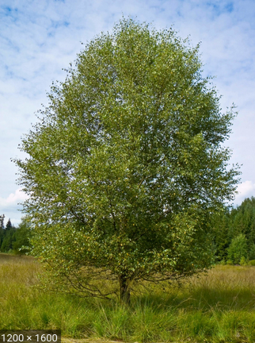

- **Acémila:** Mula o macho que se usa para llevar carga.
- **Acometer:** Atacar con ímpetu y fuerza contra algo o contra alguien.
- **Acusiante:** Que se manifiesta con fuerza, viveza y pasión.
- **Adepto-(a):** Que es partidario de una persona, una cosa o una idea.
- **Adusta:** Que es excesivamente rígido, áspero y desapacible en el trato.
- **Afable:** Que es agradable, apacible y cordial en el trato.
- **Agachadizas - Gallinago:** Es una especie de ave Charadriiforme de la familia Scolopacidae ampliamente distribuida en Eurasia, África y América.

  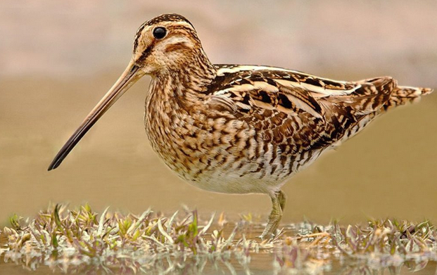

- **Aludir:** Referirse a una persona o una cosa sin nombrarlos de forma expresa.
- **Alforfón - Trigo Sacarreno:** El alforfón o trigo sarraceno es una planta anual herbácea de la familia Polygonaceae cultivada por sus granos para su consumo humano y animal. Se considera popularmente un cereal, aunque realmente no lo sea, ya que, aunque se parece, no pertenece a la familia de las gramíneas, sino a las poligonáceas.

  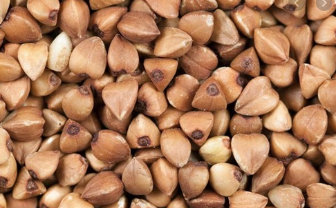

- **Aliciente:** Aspecto positivo de algo, que sirve de estímulo y mueve a una persona a realizar una acción o a actuar de determinada manera.
- **Antípoda:** Que está situado diametralmente opuesto a otro.
- **Añinos:** Se llaman añinos o añinas a las pieles con su lana de los corderos que no llegan a un año y que han sido adobadas por los curtidores
- **Añorar:** Recordar con pena a alguien o algo ausente, lejano, perdido o del que se ha sido privado.
- **Aquilina - (o):** Que es aguileño
- **Apear:** Bajar de un vehículo o de una caballería en que se va montado.
- **Apero:** 1 - Utensilio o herramienta de determinados oficios o actividades, en especial de las faenas agrícolas. 2 - Lugar donde se recogen el ganado y los pastores por la noche.
- **Argamaza:** Mezcla de diversos materiales, como cal o cemento, arena y agua, que se usa en la construcción para fijar ladrillos y cubrir paredes.
- **Argüir:** Sacar una conclusión por medio de un razonamiento a partir de un supuesto anterior o de un principio general.
- **Arrobamiento:** Estado de la persona que siente un placer, una admiración o una alegría tan intensos que no puede pensar ni sentir nada más.
- **Asió:** Tomar o coger con la mano, y, en general, tomar, coger, prender.
- **Aristocracia:** Clase social formada por las personas que poseen títulos nobiliarios concedidos por el rey o heredados de sus antepasados.
- **Asiduo-(a):** Que realiza con constancia y con cierta continuidad o frecuencia alguna cosa.
- **Atusar:** Alisar el pelo o arreglar ligeramente el peinado pasando superficialmente la mano o el peine.
- **Auscultar:** 1 - Intentar averiguar el pensamiento de otra persona o su disposición acerca de un asunto. 2 - Escuchar los sonidos que se producen en el interior de un organismo humano o animal, especialmente en la cavidad torácica y abdominal, mediante los instrumentos adecuados o sin ellos.
- **Austero:** 1 - Que es sencillo y sin alardes ni adornos superfluos. 2 - Que es estricto en el cumplimiento de las normas morales.
- **Aya:** Persona que en una casa acomodada se encargaba del cuidado y educación de los niños.
- **Azogar:** Cubrir con azogue cristales u otros objetos. EJ: _El mar como un vasto cristal azogado / refleja la lámina de un cielo de cinc_. Contraer la enfermedad producida por la absorción de los vapores del azogue, la cual produce un temblor continuo.

## B

- **Balneario:** De los baños públicos, especialmente los medicinales y curativos, o que tiene relación con estos lugares o establecimientos.
- **Barbián:** Que es desenvuelto y simpático.
- **Barbecho:** El barbecho es una técnica de la agricultura por la cual la tierra de cultivo se deja sin sembrar durante uno o varios ciclos vegetativos. Su fin es recuperar y almacenar materia orgánica y humedad junto con evitar patógenos, esperando a que sus ciclos terminen sin poder volver a renovarse debido a la falta de hospederos disponibles.
- **Bambolear:** Hacer mover una persona o una cosa de un lado a otro de modo alternativo y continuado manteniendo fijo algún punto, en vaivén.
- **Baptisterio:** Edificio contiguo a una iglesia donde se encuentra la pila bautismal y tiene lugar la ceremonia del bautismo; generalmente es de pequeñas dimensiones, con planta redonda o poligonal y descubierto.

  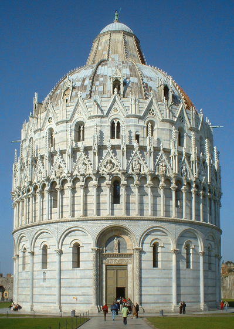

- **Batiente:** 1 - Que bate o golpea repetidas veces. 2 - Parte del cerco o marco de una puerta o ventana sobre el que baten las puertas o ventanas al cerrarse.
- **Beatífico-(a):** Que tiene o produce serenidad y placidez.
- **Berserkers:** Eran guerreros vikingos que combatían semidesnudos, cubiertos de pieles. Entraban en combate bajo cierto trance de perfil psicótico, casi insensibles al dolor, fuertes como osos o toros, y llegaban a morder sus escudos y no había fuego ni acero que los detuviera.​
- **Bribón-(ona):** Que es astuto y taimado, especialmente si utiliza artimañas para engañar o cometer delitos menores.
- **Brizna:** 1 - Filamento o hebra, especialmente de una planta o de un fruto. 2 - Porción muy pequeña de una cosa material o inmaterial.
- **Bruma:** La bruma es un fenómeno atmosférico, consistente en la suspensión de partículas diminutas de agua u otra materia higroscópica que limitan la visibilidad. Se llama así particularmente a la niebla que se forma sobre el mar.

  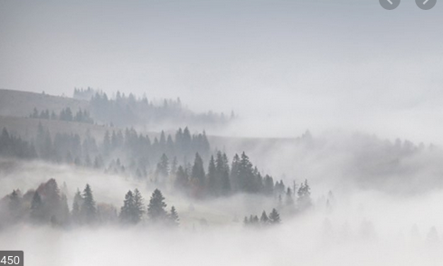

- **Bocio:** Crecimiento anormal de la glándula con forma de mariposa ubicada debajo de la nuez de Adán (tiroides).
El bocio generalmente aparece como resultado de una deficiencia de yodo o una inflamación de la glándula tiroides.

  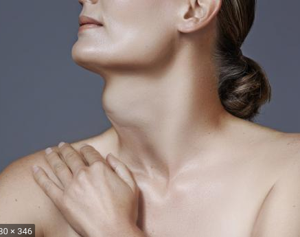

- **Borla:** Es la terminación de un grupo de hilos trenzados o fruncidos. En uno de sus extremos, sobresale un cordón holgado, del que cuelga, y en el otro costado tiene flecos. Habitualmente, las borlas son elementos decorativos, y suelen encontrarse en el dobladillo de algunas prendas de vestir y de cortinas.

  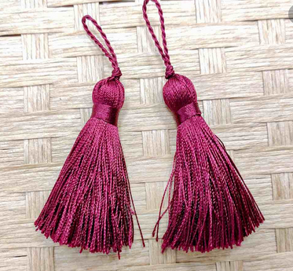

- **Boyardo:** Boyardo es el título de los nobles terratenientes eslavos, aunque se emplea sobre todo en el ámbito ruso, serbio, búlgaro y rumano.
## C

- **Cabestrillo:** Es un dispositivo utilizado para apoyar y mantener quieta (inmovilizar) una parte del cuerpo lesionada. Los cabestrillos se pueden utilizar para muchas lesiones diferentes, pero se emplean con mayor frecuencia cuando se presenta un hueso roto (fractura) o una dislocación de un brazo o un hombro.

  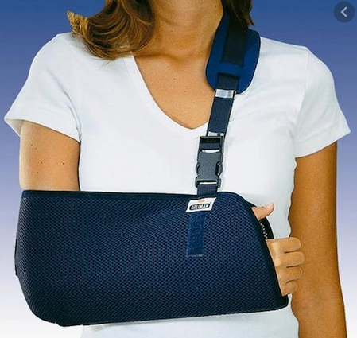

- **Caftán:** Prenda de vestir de origen oriental, generalmente de seda y con colores vivos, que cubre hasta la mitad de la pierna, tiene mangas cortas y está abierta por la parte delantera superior.
- **Caja de rapé:** on englobadas todas las series de cajitas primorosamente trabajadas en metal, porcelana u otra materia, que se fabricaron sobre todo durante el siglo XVIII.

  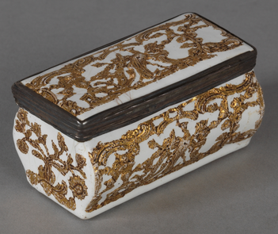

- **Calesa:** Coche de paseo tirado por caballos, de dos o cuatro ruedas, con la caja o armazón abierta por delante y con cubierta o techo plegable.

  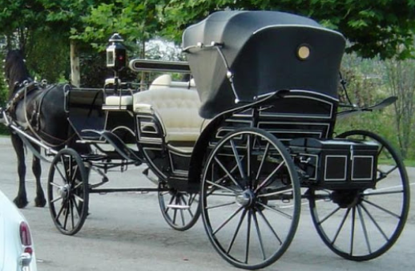

- **Campón:** El capón es un gallo castrado a la edad de cuatro meses aproximadamente, antes de comenzar el proceso de engorde. Con ello se consigue mayor tamaño y peso que los gallos camperos normales, y su carne es más fina.

  

- **Canapé:** Un canapé es un mueble similar a un sofá. Se caracteriza por la presencia de brazos y por ser acolchado en el asiento y en el respaldo. Este mueble surgió durante el reinado de Luis XIV en Francia en el siglo XVII.

  

- **Candor:** 1- Máxima blancura. 2 - Ingenuidad, falta total de malicia y de hipocresía.
- **Cebar:** Alimentar a un animal para que aumente de peso o se ponga gordo, generalmente con el fin de aprovechar su carne.
- **Charabán:** Antiguo coche descubierto con dos o más filas de asientos.
- **Cincha:** Las cinchas son una especie de fajas, comúnmente de tela de cáñamo y ribeteadas de cordobán o de badana, que abrazan y sujetan la silla del caballo sobre su lomo.

  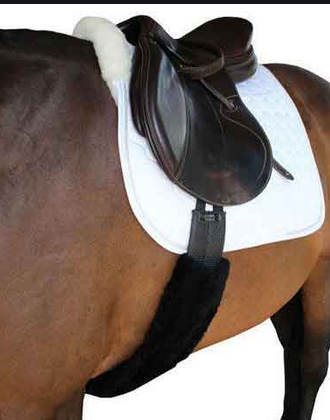

- **Cíngarp-(a):** Que pertenece a la raza gitana, especialmente la de Europa central.
- **Coloquio:** Conversación entre dos o más personas.
- **Condescendiente:** Actitud de la persona que se acomoda o adapta al gusto y la voluntad de otra.
- **Confitura:** Se llama confitura al producto resultante de recubrir con un baño de azúcar una fruta o una semilla para hacerla más agradable.
- **Conturbar:** Alterar el ánimo de una persona de manera que pierda la serenidad o que no acierte a hablar ni a proseguir lo que hacía.
- **Corvejón:** Se llama corvejón a la articulación situada en la parte inferior de la pierna y superior de la caña de los cuadrúpedos.

  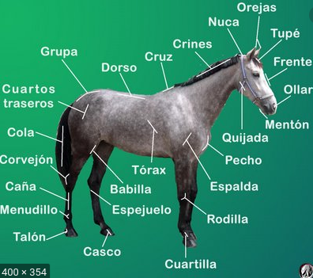

- **Crencha:** Línea que se forma en el peinado al separar los cabellos con el peine, echando una parte de ellos hacia un lado y otra hacia el opuesto.
- **Criba:** La criba es un utensilio que se emplea para limpiar el grano (principalmente del trigo) de la paja, el polvo y otros sólidos no deseados con que se haya mezclado. A esta operación se la llama ahechar.
- **Cupé:** Cupé​​ o coupé (del francés couper, «cortar») es un tipo de carrocería de automóvil de dos o tres volúmenes y dos puertas laterales.

  

- **Cumplimentar:** Hacer una visita de cortesía a alguien con motivo de algún acontecimiento próspero o adverso.

## D

- **Decimónico:** Del siglo XIX o relacionado con él.
- **Deleznable:** 1 - Que es despreciable y no merece ser tenido en consideración. 2 - Que se rompe, se disgrega o se deshace fácilmente.
- **Desbandarse:** Separarse en desorden y en diferentes direcciones.
- **Desdén:** Actitud de indiferencia y desprecio hacia una persona o una cosa.
- **Dilapidar:** Malgastar el dinero o los bienes.
- **Disonancia:** Falta de correspondencia, conformidad o igualdad entre dos o más cosas.
- **Dispensar:** 1 - Otorgar, conceder o distribuir algo, generalmente algo positivo o que implica afecto. 2 - Suministrar algo, especialmente medicamentos o recetas médicas.
- **Displicencia:** Actitud indiferente y de desagrado hacia algo o alguien.
- **Diván:** Un diván es un tipo de mueble para sentarse, similar al sofá. Originalmente, en Oriente, un diván era un asiento largo formado por un colchón puesto contra un lado de la estancia, bien en el suelo, bien sobre una estructura o un marco levantado, con cojines para apoyarse.

  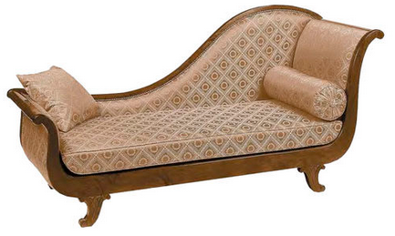

- **Deferencia:** 1 - Adhesión con la opinión o el comportamiento de una persona por respeto hacia ella o por excesiva moderación. 2 - Muestra de respeto y cortesía.
- **Doncella:** Mujer que, a cambio de una retribución económica, realiza los trabajos domésticos de una casa, no relacionados con la cocina, o que sirve a la señora de la casa.
- **Duela:** Tablilla con que se forman las paredes curvas de un tonel, barril o cuba.

## E

- **Elucidar:** Dilucidar o aclarar una cosa.
- **Embelesar:** Producir un sentimiento de placer o admiración tan intenso que enfrasca en su disfrute a la persona que lo contempla, oye, etc., y le hace olvidarse de todo lo demás.
- **Enagua:** Una enagua ​ es una prenda de ropa interior femenina. Se usa más en plural.​ También se conocen como combinación.​ La enagua es una falda usada como ropa interior pero sobre ropa interior íntima.

  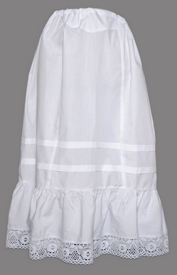

- **Encabritar:** 1 - Provocar agitación o excitación en algo o a alguien. 2 - Ponerse [un caballo] sobre las patas traseras, levantando las delanteras.
- **Endosar:** 1 - Pasar a otra persona un trabajo o una cosa que resulta pesada o molesta. 2 - es una declaración, pura y simple, puesta en el título-valor por la cual su tenedor legitima a otra persona en el ejercicio de los derechos incorporados al título
- **Entremés:** Un entremés es una pequeña porción de alimento que se sirve durante las comidas o cenas para picar de ellas mientras se sirven los platos
- **Empaladiza:** Valla hecha con palos, cañas, estacas, etc., clavados en el suelo y que sirve como defensa o para cercar un terreno.
- **Eremita:** Persona que vive sola en un lugar deshabitado, especialmente para dedicar su vida a la oración y al sacrificio.
- **Escatimar:** Dar o emplear la menor cantidad posible de cierta cosa.
- **Escueto-(a):** Que es simple, sin adornos, detalles superfluos ni cosas innecesarias.
- **Esquela:** Tarjeta o papel en que se notifica la muerte de una persona y el lugar, día y hora del entierro.
- **Estío:** Verano.
- **Exámine:** 1 - Que está sin vida o no da señales de vida. 2 - Que está muy debilitado o agotado.
- **Explayar:** 1 - Extender la vista o el pensamiento. 2 - Extenderse al hablar de cierta cosa.

## F

- **Fámulo:** Criado o sirviente de un convento u otro medio eclesiástico. Criado o sirviente doméstico.
- **Fatuo:** Que se muestra engreído en su actitud, comportamiento o manera de hablar.
- **Follón:** Lío, situación o asunto confuso, desordenado, problemático o difícil de resolver.
- **Fonógrafo:** El fonógrafo fue el primer dispositivo más común para grabar y reproducir sonidos desde la década de 1870 hasta la década de 1880. El fonógrafo fue inventado por Thomas Alva Edison. En sus formas posteriores, también se llama un gramófono, o, desde la década de 1940, un reproductor de discos.

  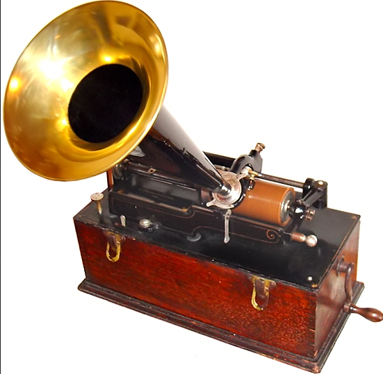

- **Frac:** El frac es un traje masculino de tipo formal que constituye el tipo de vestuario más formal para el hombre en celebraciones nocturnas.

  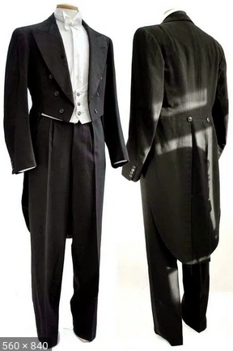

- **Frailecillos:** Fratercula es un género de aves caradriformes de la familia Alcidae conocidos vulgarmente como frailecillos.​​ Son propios del Holártico. Los frailecillos tienen con un pico de colores brillantes durante la temporada de cría. Son aves marinas que se alimentan principalmente mediante buceo bajo el agua.

  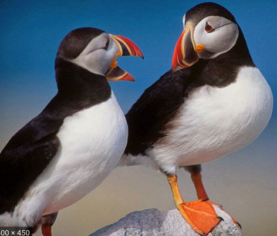

- **Frontispicio:** En artes gráficas, un frontispicio o frontis es una ilustración decorativa elaborada para aparecer en la hoja que antecede a la página del título o en esta misma.
- **Fullería:** Trampa en el juego o astucia con que se pretende engañar.
- **Fustigar:** 1 - Dar golpes o azotar con un instrumento, especialmente al caballo con la fusta para estimularlo. 2 - Criticar o reprender con dureza a una persona o una cosa.
- **Fútil:** Que carece de importancia o interés por su falta de fundamento.

## G

- **Goleta:** Embarcación antigua con las bordas poco elevadas, de dos o tres palos, cada uno de ellos con un solo mastelero o palo menor y una sola vela cangreja o trapezoidal.

  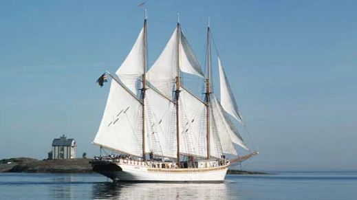

- **Gorguera:** Cuello rígido, redondo, generalmente de lino, holanda o encaje, doblado formando pliegues y ondulaciones, que se usó en Europa occidental los siglos XVI y XVII.

  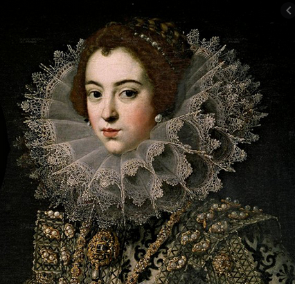

- **Gozne:** Bisagra, especialmente la de una puerta o ventana.
- **Gualdrapa:** Gualdrapa es la tela que se pone sobre la silla de montar y las ancas de la mula o sobre el caballo​para que el lodo no salpique al caballero o no le moleste el polvo, el sudor o el propio pelo del animal.​

  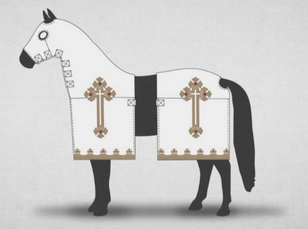

- **Guisa:** Modo, manera.

## H

- **Hacina:** Conjunto de haces de mies colocados unos sobre otros formando un montón.

  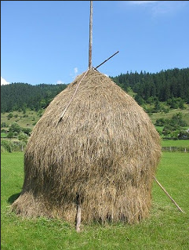

- **Hastío:** Aburrimiento muy grande.
- **Hemisferio:** Mitad de una esfera dividida por un plano que pasa por su centro.
- **Hilvanar:** Hacer algo de manera provisional y esquemática.
- **Hirsuto:** Que es áspero, duro y tieso.

## I

- **Ignominia:** Ofensa grave que sufre el honor o la dignidad de una persona.
- **Ilación:** Trabazón o nexo con que se siguen las partes de un discurso, un razonamiento, etc.
- **Imberbe:** Que no tiene pelo en la barba o tiene muy poco, en especial si es joven.
- **Impávido:** 1 - Que hace frente a una situación de peligro o riesgo sin dejarse dominar por el miedo o la angustia. 2 - Que no se altera, perturba o muestra emoción alguna ante una impresión o estímulo externo que normalmente producen turbación, desencadenan una emoción o inducen a determinada acción.
- **Incisivo:** 1 - Que está situado en la parte delantera de la boca y tiene la función de cortar los alimentos. 2 - Que profundiza o penetra hasta el fondo de las cosas, o más allá de lo que se considera normal.
- **Indagar:** Tratar de llegar al conocimiento de una cosa reflexionando sobre ella o por conjeturas y pruebas.
- **Indulgencia:** Actitud o tendencia de la persona que tiene especial facilidad para perdonar las ofensas, o castigarlas con benevolencia, y para juzgar sin severidad los errores de los demás.
- **Inexpugnable:** Que resulta imposible de conquistar.
- **Inefable:** Que no puede ser dicho, explicado o descrito con palabras, generalmente por tener cualidades excelsas o por ser muy sutil o difuso.
- **Infimo:** Que es muy bajo en cantidad, calidad o importancia.
- **In-folio:** In-folio o infolio (del latín in folio, en hoja) o, abreviado como in-2º, es un término técnico utilizado en encuadernación que indica el tamaño de un libro, donde la hoja impresa se ha doblado sólo una vez sobre el lado menor, por lo que da lugar a dos folios que equivalen a cuatro páginas.  
Cuando la hoja se dobla en cuatro, se habla de in-cuarto o in-4º; si en 8, in-octavo o in-8º; si en 16, in-decimosexto o in-16º; si en 32, in-32º y si en 64, in-64º.

  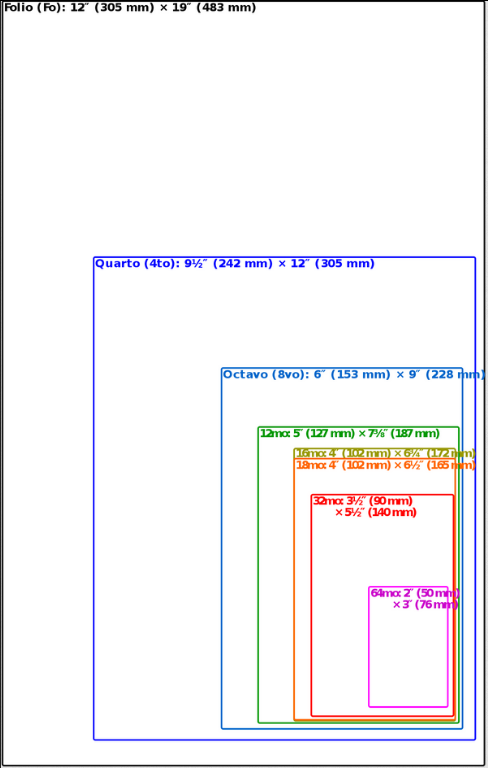

- **Inocular:** Introducir en el organismo por medios artificiales el virus o la bacteria de una enfermedad contagiosa.
- **Intemperancia:** Falta de templanza o moderación.
- **Irascible:** Que es propenso a irritarse.
- **Irrisorio-(a):** 1 Que provoca risa y burla. 2 - Que es muy pequeño o insignificante.
- **Isbá:** Una izbá o isbá es una típica vivienda campesina rusa. Construida con troncos, constituía la residencia habitual de una familia campesina rusa tradicional. Generalmente se construían cerca de un camino y dentro de un corral, que también incluía un jardín, un henil y un granero.

## J

- **Jovial:** Que es alegre de modo que resulta festivo y apacible.
- **Juerga:** Diversión o fiesta animada, bulliciosa y en la que a veces se cometen excesos.
## K

- **Kasha:** Plato típico ruso. Especie de gachas de arroz, sémola, alforfón o cebada perlada.

  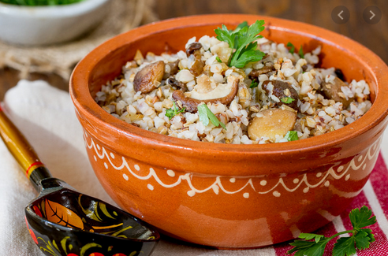

## L

- **Labriego:** Persona que tiene por oficio trabajar y cultivar la tierra y vive en el medio rural.
- **Lacayo::** 1 - Criado uniformado que acompañaba a su señor para prestarle ciertos servicios, como abrirle y cerrarle la puerta del automóvil cuando este viajaba. 2 - Soldado de a pie que, junto con otro, acompañaba a un caballero en la guerra e iba armado con una ballesta.
- **Lacerar:** 1 - Desgarrar la carne de una persona o un animal. 2 - Perjudicar moralmente a alguien.
- **Lacónico:** Laconismo es la forma de expresarse breve y concisamente, con las palabras justas y, a la vez, ingeniosamente.
- **Lanceta:** Una lanceta para sangre o simplemente lanceta, es un pequeño instrumento médico usado para el muestreo de sangre capilar. Esta es similar a un pequeño bisturí pero con una hoja de doble filo o aguja.

  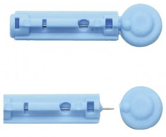

- **Lánguido:** Que carece de fuerza, vigor o lozanía.
- **Laxo:** 1 - Que está flojo, carece de rigidez o tensión. 2 - Que es poco riguroso o severo en cuestiones de moral.
- **Lisonjar:** Alabar de forma exagerada y generalmente interesada a una persona para conseguir un favor o para ganar su voluntad.
- **LLaneza:** Manera sencilla, clara de hacer o decir las cosas.
- **Lóbrego:** 1 - Que es oscuro o sombrío e inspira temor o tristeza. 2 - Que es confuso o incierto.
- **Locuaz:** Que habla mucho, en especial cuando lo hace con soltura o facilidad.                      
- **Lunático:** Que tiene cambios bruscos de carácter o de humor sin explicación.

## M

- **Malediciencia:** Acción de maldecir o difamar a alguien.
- **Malecón:** Muro grueso construido a la orilla del mar, playa o puerto para protegerlos de la fuerza del agua.
- **Mamaliga:** La mămăligă, pulicka en húngaro es un pan elaborado con harina de maíz, sémola consistente en una masa de color amarillo. Es muy típica en la cocina rumana, y se asemeja a la polenta italiana. La mămăliga es un alimento tradicional de Rumanía y Moldavia.

  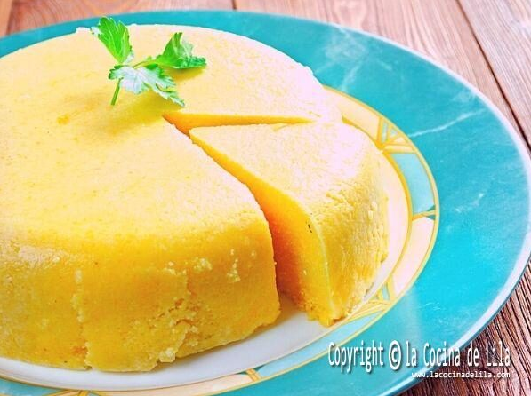

- **Marmórea:** Que tiene la dureza, el color u otra característica propia del mármol.
- **Mayólica:** Es el nombre que se da desde el Renacimiento a un tipo de decoración cerámica sobre loza estannífera, con un esmalte de plomo opacificado con estaño, posteriormente se decora los diversos motivos con óxidos sobre la anterior base.

  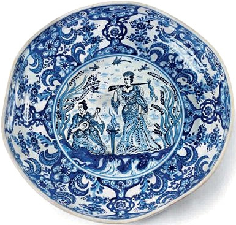

- **Mendrugo:** Pedazo de pan duro o desechado, especialmente el sobrante.
- **Menester:** 1  Falta o necesidad de algo. 2 - Ser preciso o necesario.
- **Mies:** Cereal que ya está maduro para ser recolectado.
- **Mieses:** Terrenos en los que se cultivan cereales.
- **Minucioso-(a):** Que hace las cosas con detenimiento y cuidando los más pequeños detalles.
- **Minuta:** 1 - Cuenta que presenta un profesional liberal como honorarios por su trabajo. Borrador que se hace de un escrito, especialmente de un contrato, antes de redactarlo definitivamente.
- **Mofarse:** Burlarse de una persona o de una cosa tratándolas con desconsideración o desprecio.
- **Moh+in:** Gesto del rostro con el que se expresa desagrado o enfado, especialmente el que se hace con los labios.
- **Muselina:** La muselina es una tela fina de algodón. Recibe su nombre de la ciudad de Mosul, Irak, que es su lugar de origen.​​

  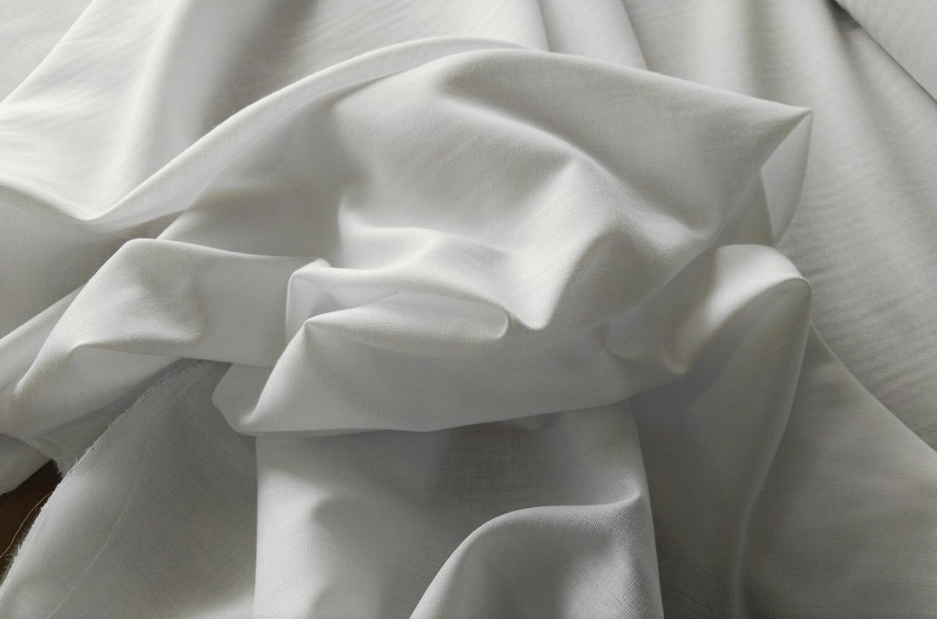

## N

## Ñ

## O

- **Oblongo:** Que es más largo que ancho o que es más largo de lo que es habitual entre las cosas de su mismo género.
- **Oprobio:** Deshonra o vergüenza públicas.
- **Ortodoxia:** Conformidad con los principios de una doctrina o con las normas o prácticas tradicionales, aceptadas por la mayoría como las más adecuadas en un determinado ámbito.
- **Osado:** 1 - Que se atreve a afrontar situaciones difíciles o peligrosas con valentía y entereza. 2 - Que habla u obra con atrevimiento y descaro.

## P

- **Palafrenero:** Un palafrenero era, antiguamente, el criado que llevaba el caballo cogido del freno. La palabra proviene de *palafrén*, el caballo que suele montar el criado cuando acompañaba a su amo a cabal.
- **Palimpsesto:** Manuscrito en el que se ha borrado, mediante raspado u otro procedimiento, el texto primitivo para volver a escribir un nuevo texto.
- **Paneslavismo:** El paneslavismo es un movimiento político y cultural, nacido de una ideología nacionalista, surgido en el siglo XIX con el objetivo de promover la unión cultural, religiosa y política, así como la mutua cooperación, entre todos los países eslavos de Europa.
- **Párvulo:** Niño de corta edad, que no ha alcanzado la edad escolar, especialmente el que asiste a un centro o a una clase de educación preescolar.
- **Parlamentar:** Discutir sobre un asunto o sobre un problema con la intención de llegar a un acuerdo o de encontrar una solución.
- **Pasmo:** Asombro o sorpresa exagerada que impide a una persona hablar o reaccionar.
- **Patizambo-(a):** Que tiene las piernas torcidas de modo que se juntan las rodillas y se separan los pies.
- **Pecuniario:** Del dinero o relacionado con el dinero.
- **Pelliza:** Chaqueta con cuello y bocamangas de piel o reforzados de otra tela.

  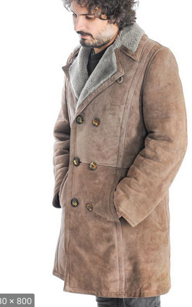

- **Peñasco:** Roca de mayor tamaño y altura que la peña, situada generalmente en un lugar alto.
- **Persignar:** Hacer con la punta de los dedos de la mano, especialmente con los dedos índice y pulgar, tres cruces, la primera en la frente, la segunda en la boca y la tercera en el pecho.

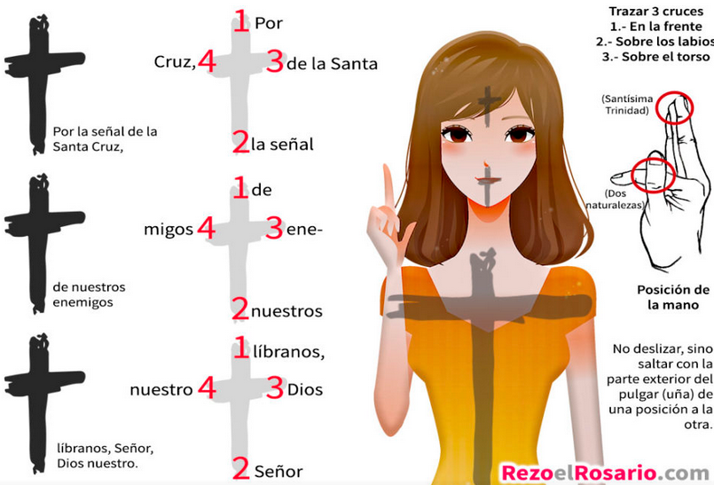

- **Pesquisa:** nvestigación que se hace de una cosa para descubrir o averiguar algo, en especial la que realiza la policía.
- **Pétreo-(a):** Que tiene la dureza, textura u otra característica propia de la piedra.
- **Piafar:** Alzar el caballo, estando parado, las patas delanteras alternativamente dejándolas caer con fuerza y en el mismo punto en que estaban.
- **Pitanza:** 1 - Alimento que toma una persona. 2 - Ración de comida que se da a la gente que vive en comunidad o a los pobres.
- **Plegadera:** Utensilio para plegar o cortar papel que tiene forma parecida a un cuchillo sin filo.

  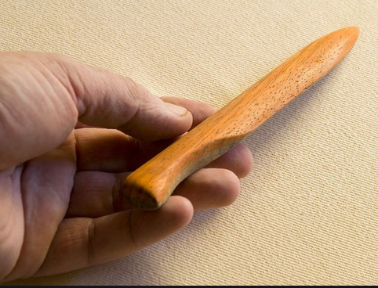

- **Porra:** Palo con una bola o cabeza gruesa y redondeada en uno de sus extremos, que se usa como arma para golpear.
- **Postín:** Distinción o elegancia de las personas ricas.
- **Postrernarse:** Arrodillarse en señal de respeto.
- **Potaje:** Guiso caldoso que se prepara con legumbres y verduras o arroz al que en ocasiones se le añade trozos de algún tipo de carne o de embutido; es un plato típico de diversas regiones españolas, variando en cada una el tipo y cantidad de ingredientes.

  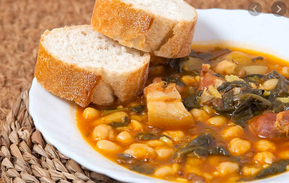

- **Presteza:** Habilidad y rapidez para hacer o decir una cosa.
- **Profuso-(a):** Que es muy abundante.
- **Proindiviso:**  El derecho parcial de una persona sobre una propiedad. La razón es que comparte la titularidad con una o más personas, por lo que se considera una comunidad de bienes o copropiedad.
- **Prosaico:** Que resulta vulgar o carece de emoción o interés o elevación, por estar demasiado relacionado con lo material.
- **Prosapia:** Ascendencia o linaje de una persona, en especial si es ilustre o aristocrático.
- **Pueril:** 1 - Que es propio de los niños pequeños o tiene alguna característica propia de ellos. 2 - Que tiene poco valor, poco interés o poca importancia.

## Q

## R

- **Radiolarios:** son un grupo de protistas ameboides que producen intrincados esqueletos minerales, que se encuentran como zooplancton en el océano.​ Suelen ser unicelulares, aunque algunos forman colonias de miles de individuos. Las dos características más distintivas de los radiolarios son su esqueleto y los axopodios. Los radiolarios producen un esqueleto que puede tener una estructura muy elaborada y de gran belleza, con una apariencia opalina. Del cuerpo de la célula salen numerosas proyecciones denominadas axopodios que le dan una apariencia radiada y le sirven al organismo para el movimiento y para capturar pequeñas presas.

  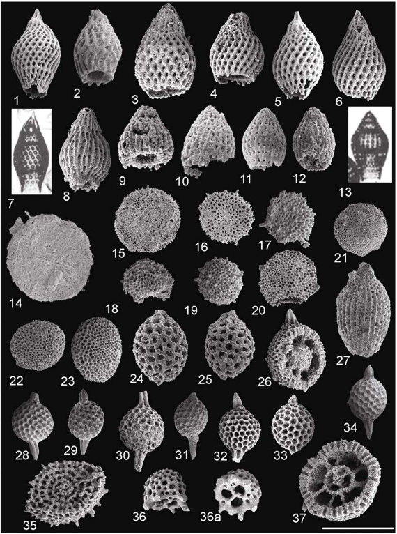

- **Ralo:** Que es poco espeso o poblado.
- **Regimiento:** Unidad militar compuesta por varios batallones de un arma determinada y mandada por un coronel.fi
- **Resongar:** Emitir sonidos no articulados o palabras murmuradas entre dientes en señal de enfado o desagrado.
- **Reticencia:** Hecho de insinuar o no decir directamente algo, generalmente con intención maliciosa.
- **Rezumar:** Salir [un líquido] de un cuerpo o del recipiente en que está contenido, por transpiración o a través de sus rendijas.
- **Rodaballo:** El rodaballo o turbot es una especie de pez pleuronectiforme de la familia Scophthalmidae.

  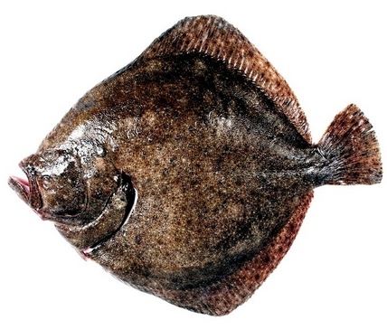

- **Rosbif:** El Roast Beef es un corte de buey tierno que se asa al horno. En la cocina inglesa, y por extensión en muchos países de tradición anglosajona como Australia, el roast beef es un plato muy tradicional, servido preferentemente los domingos.

  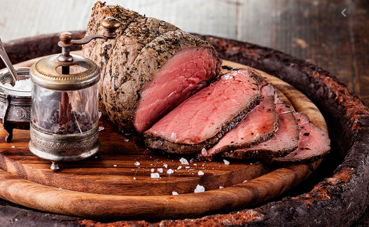

- **Rubicundo-(a):** Que es de color rubio que tira a rojo.
## S

- **Sacarina:** es un aditivo edulcorante artificial que no contiene calorías. Fue descubierto en 1879, es entre 300 y 500 veces más dulce que la sacarosa y se utiliza en alimentos y bebidas.
- **Sacristán:** Persona que cuida de los objetos guardados en la sacristía y de la limpieza de la iglesia; también puede ayudar al sacerdote en el altar.
- **Samovar:** El samovar es un recipiente metálico en forma de cafetera alta, dotado de una chimenea interior con infiernillo, y sirve para hacer té. Con el paso de los siglos, el samovar se ha convertido en un icono de la cultura rusa del té.

  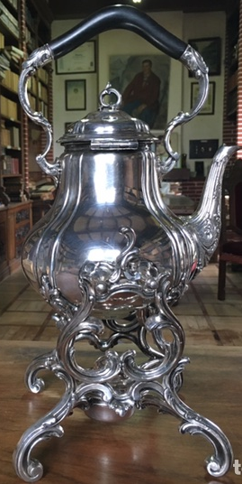

- **Saturnino:** Que es de carácter triste y taciturno.
- **Schi:** Sopa típica rusa a base de col.

  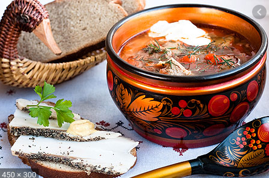

- **Séquito:** Grupo de personas que acompaña a un lugar a otra más importante, especialmente en una ceremonia o en un acto solemne.
- **Simiente:** Grano contenido en el interior del fruto de una planta y que, puesto en las condiciones adecuadas, germina y da origen a una nueva planta de la misma especie.
- **Sinuoso:** 1 - Que tiene recodos, curvas y ondulaciones irregulares y en distintos sentidos. 2 - Que es poco claro y pretende ocultar la verdadera intención o propósito de sus acciones, objetivos o manifestaciones.
- **Socavar:** 1 - Excavar alguna cosa por debajo, dejándola sin apoyo y expuesta a hundirse. 2 - Debilitar la fuerza moral de una ideología o un valor espiritual, o de la persona que la defiende o representa.
- **Sofisma:** Argumento falso o capcioso que se pretende hacer pasar por verdadero.
- **Solaz:** Placer, entretenimiento y descanso de las actividades habituales.
- **Soporífero-(a):** Que es tan aburrido que provoca ganas de dormir.
- **Sórdido:** 1 Que es miserable o sucio. 2 - Que es indecente o malicioso.
- **Sosiego:** Estado de trasnquilidad o calma en algo o alguien.
- **Sublevar:** 1 - Enfrentarse a un poder establecido, utilizando la fuerza o las armas. 2 - Irritarse o alterarse mucho una persona.
- **Subversivo-(a):** Que pretende alterar el orden social o destruir la estabilidad política de un país.

## T

- **Taciturno:** Que es habitualmente callado o silencioso.
- **Tafilete:** Piel curtida bruñida y lustrosa mucho más delgada y adaptable que el cordobán; se utiliza para la fabricación de bolsos, guantes, zapatos, etc.
- **Tapia:** Trozo de pared o muro que se hace de una sola vez con barro apisonado en un molde (tapial) y después secado al sol.
- **Tara:** Defecto de una cosa manufacturada, especialmente el que no pasa de ser una leve imperfección que disminuye el valor de un objeto.
- **Taquigrafía:** La taquigrafía o estenografía es todo aquel sistema de escritura rápido y conciso que permite transcribir un discurso a la misma velocidad a la que se habla. Para ello se suelen emplear trazos breves, abreviaturas y caracteres especiales para representar letras, palabras e incluso frases.

  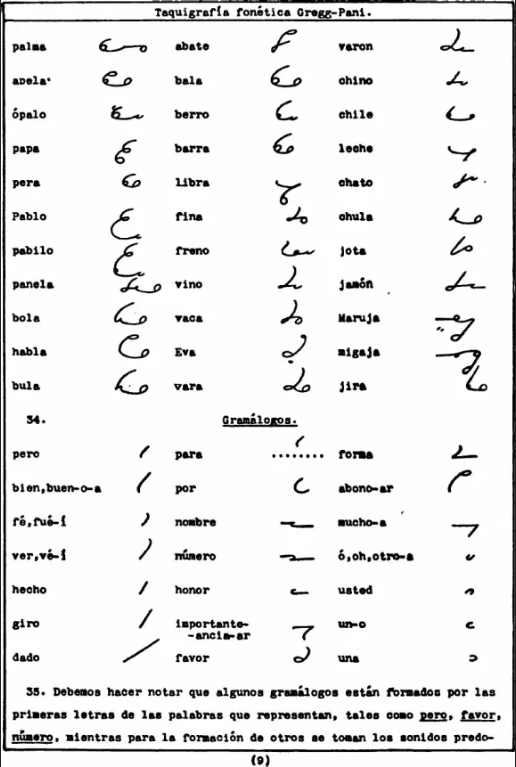

- **Tez:** Piel de la cara de una persona.
- **Torvo-(a):** Que tiene aspecto fiero y airado.
- **Trajinar:** Moverse mucho una persona o andar de un sitio para otro.
- **Trascender:** Hacer sentir sus efectos o tener consecuencias en lugar o medio distinto de aquel en que se produce.
- **Tubo neumático:** Son sistemas en los cuales contenedores cilíndricos son propulsados a través de una red de tubos por medio de aire comprimido o por medio de vacío. Son usados para transportar objetos sólidos, al contrario de las tuberías comunes, que transportan gases o fluidos.

![Tubo neumático]

## U

- **Ujier, Hujier:** Portero de un palacio o de un tribunal.

## V

- **Vaho:** Vapor que despiden los cuerpos en determinadas circunstancias.
- **Vahos:** Terapia para el tratamiento de resfríos y enfermedades del aparato respiratorio que consiste en respirar el vapor que despide una sustancia al hervirla.
- **Vaticinio:** Acción de anunciar un hecho futuro a partir de ciertos indicios o por simple intuición.
- **Vehemente:** Que obra de forma irreflexiva y apasionada, dejándose llevar por los sentimientos o los impulsos.
- **Vellón:** Conjunto de lana que se le quita a una oveja o a un carnero al esquilarlo.
- **Visillo:** Un visillo es una cortina de tela fina que permite el paso de la luz de forma velada y no impide totalmente la vista. Se confeccionan en tejidos transparentes, siendo los más habituales el hilo y el lino.​

  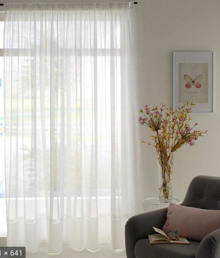

- **Vituperar:** Censurar o desaprobar con mucha dureza una cosa o a una persona.

## W

## X

## Y

## Z

- **Zafio:** Que es inculto y no tiene finura.
- **Zaguán:** Un zaguán es, en términos genéricos, un espacio cubierto situado en las casas, normalmente junto a la puerta.​ En este sentido, tiene un significado similar a vestíbulo. Es un elemento de paso, sin carácter habitacional.
- **Zalamería:** Demostración de cariño exagerada y a veces empalagosa, generalmente para conseguir algo.
- **Zamarra:** Prenda amplia de vestir, rústica, de abrigo, que cubre el cuerpo hasta medio muslo, hecha de piel con lana o pelo por fuera o por dentro.

  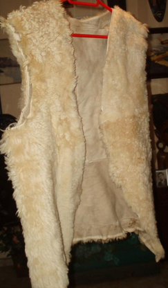

- **Zemstvo:** Asambeas o Cámaras autónomas provinciales y municipales, que se crearon en Rusia en tiempos de Alejandro II.
- **Zíngaro:** Que pertenece a la raza gitana, especialmente la de Europa central.
- **Zozobra:** Sentimiento de tristeza, angustia o inquietud de quien teme algo.